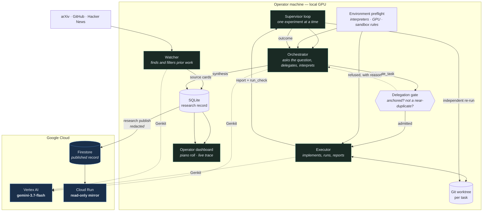

# Lean Research Runtime

An autonomous research runtime for accumulating **understanding**, not scores.

## Abstract

The current wave of harness development and “autoresearch” pipelines has largely been designed to
maximize benchmark scores: propose a change, run the evaluator, keep it if the number improves,
and repeat.
That is a reasonable engineering loop when the benchmark is the specification. It is a poor
motivation for research. It invites Goodhart’s law — once a measure becomes a target, it ceases to
be a good measure — because a system can learn to improve the measurement without improving the
thing the measurement was meant to represent.

This project starts from that concern. Lean Research Runtime is a pure research direction: an
attempt to build an autonomous system whose basic unit is not a score improvement but an
investigation. It starts with a question and competing explanations, uses experiments as evidence,
records what the evidence supports or rules out, and leaves every result bounded by the conditions
actually tested. A negative, bounded or inconclusive result is still a finding. The aim is a
cumulative research record that becomes clearer and more useful over time, not a leaderboard.

The project is inspired by Terence Tao’s [*Mathematics in the age of AI*](https://arxiv.org/abs/2608.16753).
Tao’s argument is to look beyond the capabilities question — whether AI can perform research-level
tasks — and ask what goals and values research should preserve when those capabilities arrive. We
follow that philosophy here. The runtime makes those values operational: research questions are
anchored in prior evidence; competing explanations are kept visible; claims stay within their
evidence; decisive checks are independently rerun; and the system is allowed to stop when more
activity would not produce more understanding. The point is not to make an agent look autonomous.
It is to test whether an autonomous process can produce research that another person can inspect,
question and build on.

In an unattended run on a consumer GPU, the prototype produced four findings across four research
threads, including one that **refuted its own hypothesis** and one that recorded a **wall-clock
slowdown** as a real result. The rest of this document describes the runtime and the constraints
that make those findings possible.

**Live mirror:** https://research-mirror-qdqttyl3jq-uc.a.run.app

---

## Architecture



**The loop:** the watcher admits prior work → the orchestrator picks one unresolved question and
writes a brief → a gate refuses briefs that cite no evidence or repeat an earlier study → the
executor implements it in an isolated git worktree → the runtime **independently re-runs** every
decisive check → the orchestrator interprets the result into an outcome, and material findings
into a synthesis that later evidence can supersede.

---

## What makes it research rather than hill climbing

These are enforced, not aspirational:

| Mechanism | Enforcement |
|---|---|
| No global score or incumbent | Nothing in the scheduler reads a metric; tasks are chosen from unresolved questions |
| Every task is anchored to evidence | A brief citing no existing `COMP`/`OUT`/`SRC`/`SYN` identifier is **refused** once the direction holds any evidence |
| No silent repetition | A brief ≥75% identical to an earlier task is **refused** unless it names that task and says which explanation the difference discriminates |
| Claims stay inside their evidence | Every outcome must state its envelope — models, context lengths, hardware, sample size, untested regimes |
| Negative results are findings | `refuted`, `bounded` and `inconclusive` are terminal research outcomes, not errors |
| Understanding accumulates | Syntheses attach to research threads and supersede one another; every revision stays tentative and is replaced only by better evidence |
| The agent may stop | The orchestrator can pause a direction when it judges a milestone reached, instead of manufacturing work |

Refusals are not silent: they are written back as runtime feedback and appear in the
orchestrator's next context, so a bad move gets corrected rather than repeated.

---

## Running continuously without busy work

The orchestrator does research when there is something to research, and costs
almost nothing when there is not. That is a property of the runtime, not an
instruction to the model: no prompt tells it to keep going, and `pause_research`
remains a move it can choose at any time.

Work runs while work exists — a queued task goes to the executor, otherwise the
orchestrator takes a turn. The supervisor only has to decide anything when the
loop comes back with nothing:

| the loop returned | what the supervisor does |
|---|---|
| operator stop, or the spend ceiling was reached | exit |
| the orchestrator paused, continuous mode off | exit; the pause stands |
| the orchestrator paused, continuous mode on | take the direction up again, then wait |
| nothing delegated this turn | wait |

A pause and an idle turn are the same signal — nothing is worth doing right now —
so both wait on the same curve, doubling from one minute to a thirty-minute
ceiling:

```
1 → 2 → 4 → 8 → 16 → 30 minutes, then capped
```

**The wait resets to one minute the moment anything happens in the direction**: a
source admitted, a task delegated or returned, an outcome recorded, a synthesis
written, a delegation refused. Ten quiet hours therefore cost about two dozen
orchestrator turns rather than a paid poll every few seconds.

In practice the watcher becomes the metronome. When the orchestrator has
exhausted its current questions it pauses, is taken up again, pauses again, and
the interval stretches to half an hour. Then the watcher admits a paper, that
appends an event, the wait snaps back to a minute, and the orchestrator wakes to
weigh the new evidence. **Research resumes because evidence arrived, not because
a timer fired.**

Continuous mode is a deployment choice made outside the model — `research
continuous` to enable, `--off` to make a pause final. Either way the pause and
the reasoning behind it stay in the record.

---


## Features

- **Autonomous research loop** — watcher, orchestrator and executor, one experiment at a time.
- **Independent verification** — every `run_check` the executor makes is re-run by the runtime
  itself, so a result is never taken on the agent's word.
- **Environment preflight** — the runtime measures interpreters, CUDA, VRAM and the command
  sandbox once and hands the same verified sheet to both agents, so no research turn is spent
  rediscovering the machine.
- **Attempt continuity** — a task keeps one git worktree across attempts. A provider error or an
  operator restart resumes into the work already on disk instead of discarding it.
- **Full execution observability** — a piano roll showing where wall-clock time actually went
  (reasoning, each tool call, model wait, errors) and a searchable live agent trace.
- **Honest cost accounting** — usage is metered per model call across the whole tool loop, with
  reasoning tokens counted, and a runtime-adjustable spend ceiling.
- **Publishable record** — a redacted research record published to Firestore and served by a
  read-only Cloud Run mirror.

## Technologies

| Layer | Choice |
|---|---|
| Model | **Gemini 3.7 Flash** via **Vertex AI** |
| Agent framework | **Genkit** (`genkit`, `@genkit-ai/google-genai`) — tools, streaming, model middleware |
| Cloud infrastructure | **Firestore** (published record), **Cloud Run** (public mirror), Cloud Build, Artifact Registry |
| Runtime | Node.js 22, TypeScript, better-sqlite3, git worktrees |
| Experiments | Python 3.10, PyTorch 2.5 + CUDA 12.1, Hugging Face Transformers |
| Dashboard | Dependency-free HTML with `marked` + KaTeX served locally |

## Data sources

The watcher retrieves from **arXiv**, **GitHub** and **Hacker News** directly — the model never
performs retrieval itself. Each source is read and judged for relevance before admission, and
admitted sources are cited by identifier in the briefs and syntheses that use them.

---

## Spin-up

The runtime is local-first: **bring your own API key in `.env` and it runs on your machine.**
Nothing about the research loop needs a cloud account. The Google Cloud pieces — the published
record and its public mirror — are an optional layer on top, and everything below works without
them.

### Prerequisites

- Node.js 22+ and git
- An API key from any one supported provider
- Python 3.10 with PyTorch for GPU experiments — optional, and only for experiments that measure
  models on hardware. Directions that are analytical or source-driven do not need it.

### Configure a provider

```bash
npm install
cp .env.example .env
```

Fill in whichever provider you have a key for. `AR_MODEL` selects the model on all three:

| `AR_MODEL_PROVIDER` | Credential | Example `AR_MODEL` |
|---|---|---|
| `gemini-api` | `GEMINI_API_KEY` — free tier at [aistudio.google.com](https://aistudio.google.com/apikey) | `gemini-3.7-flash` |
| `vertex-ai` | `VERTEX_API_KEY` (express mode), or Application Default Credentials + `GOOGLE_CLOUD_PROJECT` | `gemini-3.7-flash` |
| `openrouter` | `OPENROUTER_API_KEY` | any OpenRouter model id |

```
AR_MODEL_PROVIDER=gemini-api
GEMINI_API_KEY=<your key>
AR_MODEL=gemini-3.7-flash
AR_MAX_COST_USD=20
```

Values already in the real environment always win over the file, so the same code runs unchanged in
the cloud, where configuration arrives as service environment variables. `.env` is untracked and
must stay that way.

```bash
npx tsx src/cli.ts doctor        # checks the credential, the model and the toolchain
```

### Run a direction

```bash
npx tsx src/cli.ts research preflight --refresh     # measure this machine
npx tsx src/cli.ts research init   --direction my-direction --title "My research direction"   --brief "What should be investigated and why"   --domain domains/attention.domain.json   --topic "search topic for the watcher"

npx tsx src/cli.ts research supervisor start        # the research loop
npx tsx src/cli.ts research watch start             # literature intake
npx tsx src/cli.ts research dashboard start --port 7331
```

Open http://127.0.0.1:7331. Useful controls:

```bash
npx tsx src/cli.ts research status                  # what is running
npx tsx src/cli.ts research budget --max 40         # spend ceiling, applied live
npx tsx src/cli.ts research continuous              # keep going past a pause
npx tsx src/cli.ts research stop --all              # stop everything
```

The spend ceiling is enforced before every orchestrator turn and every watcher sweep, so an
unattended run has a hard upper bound you set yourself.

### Optional: publish the record and a public mirror

Only needed if you want the research record readable outside your machine. The mirror is read-only
and scales to zero, so an idle deployment costs nothing.

```bash
gcloud auth application-default login
gcloud services enable firestore.googleapis.com run.googleapis.com   artifactregistry.googleapis.com cloudbuild.googleapis.com

# Firestore in Native mode, once per project
curl -X POST -H "Authorization: Bearer $(gcloud auth print-access-token)"   -H "Content-Type: application/json"   "https://firestore.googleapis.com/v1/projects/$PROJECT/databases?databaseId=(default)"   -d '{"locationId":"us-central1","type":"FIRESTORE_NATIVE"}'

npx tsx src/cli.ts research publish --dry-run       # inspect what would be published
npx tsx src/cli.ts research publish --project $PROJECT
gcloud builds submit --config cloudbuild.mirror.yaml --project $PROJECT
```

Set `GOOGLE_CLOUD_PROJECT` (or `AR_PUBLISH_PROJECT`) in `.env` and the supervisor republishes the
record itself, so the mirror follows the live run instead of freezing at the last manual publish.
It only writes when an event has actually been appended, so a quiet direction costs nothing, and a
Firestore failure is logged and retried rather than ending the run. `AR_MIRROR_SYNC_SECONDS`
changes the interval (default 120, floor 30); `AR_MIRROR_SYNC=off` disables it.

### Why experiments run on local hardware

Experiments execute on whatever GPU the machine has, not on a cloud accelerator. That was a
deliberate cost decision rather than a missing feature: the measured bottleneck in this system is
model latency, not device throughput — 3442s of tool time against 5695s waiting on the model, with
the local GPU at 33% utilisation — so renting an accelerator would have consumed a limited credit
grant to keep a faster card idle for two thirds of the run. The credits went to the model calls
that were actually the constraint.

Nothing in the design prevents it. The executor runs ordinary Python in a git worktree, so pointing
it at a cloud VM with a larger GPU is a matter of running the runtime there; the environment
preflight measures whatever devices it finds and the orchestrator fixes experiment scale against
that sheet. A larger card widens the model sizes and context lengths a direction can reach, which
is exactly the limitation recorded below.

### Tests

```bash
npm test        # 79 tests
npm run typecheck
```

---

## Repository layout

```
src/research/     the research runtime: supervisor, orchestrator, executor,
                  watcher, delegation gate, preflight, publisher, mirror
src/worker/       Genkit worker — tools, sandbox, metering, trace
src/config/       runtime configuration, environment loading, doctor
src/store/        cross-project memory shared with the worker
prompts/          the agent prompts; researcher.md carries the research policy
test/             73 tests, including the anti-hill-climbing invariants
deploy/           minimal dependency set for the hosted mirror
docs/             design notes and direction briefs
```

The previous architecture — a campaign harness that optimised a score — is kept
under `pi-extension/legacy-harness/` and is not reachable from this codebase.

---

## What the mirror publishes, and what it does not

Publishing is a trust boundary, so the record is narrowed rather than filtered:

- **Published:** findings, verdicts, syntheses and their provenance, task briefs, run metadata,
  the verified checks and their exit codes, admitted sources.
- **Never published:** agent prompts, execution traces, worktree contents, the environment sheet,
  and any local filesystem path. Prompts embed the preflight sheet and worktree paths, so they are
  omitted entirely rather than scrubbed; everything else passes through a redactor.
- The mirror process is isolated by its import graph — it cannot reach the SQLite store, the
  worker or the supervisor, rejects any non-GET request, and exposes no control endpoint. Tests
  enforce this.

---

## Findings and learnings

### What the system found

Running on a single RTX 3060 Ti, it produced four findings across four threads and then paused
itself, judging a milestone reached:

- **Heuristic KV-cache eviction is causally blind to unasked questions** (`bounded`). H2O's
  cumulative-attention retention scored **0% on non-local needle retrieval at 50% cache budget —
  indistinguishable from random eviction**. During prefill, filler tokens do not attend to an
  isolated fact, so attention mass cannot mark it. This refuted the study's own leading hypothesis,
  and it is only a meaningful statement because the design included a random-eviction control.
- **Speculative decoding can be a wall-clock loss at healthy acceptance** (`supported`). With
  α = 38–54%, throughput was *slower* than plain autoregressive decoding, because per-token latency
  tracks transformer **layer depth** rather than parameter count (0.5B/24 layers: 39.4 ms/tok vs
  1.5B/28 layers: 43.9 ms/tok).
- **Key and Value quantization errors differ in kind, not degree** (`supported`). Value error is
  additive through a row-stochastic attention matrix; Key error passes through a softmax and
  disperses attention. Asymmetric K-INT8/V-INT4 held retrieval at 4-bit Value precision.
- **A regime dispatcher composing all three** (`supported`) — an integration task, not another
  sweep.

### Are these findings novel?

Mostly not, and the record should say so plainly. Three of the four re-derive results that already
exist in the literature: the causal blindness of attention-mass eviction is the failure mode
StreamingLLM and later needle-retrieval work describe for H2O-style policies; the speculative
decoding result is the standard acceptance-rate/latency crossover inequality, arrived at from
measurement rather than from the algebra; and the K/V asymmetry is the finding KIVI reports and
builds its per-channel key quantization on. The dispatcher that composes them is an integration,
not a new mechanism.

That is an honest description of a system that had a consumer GPU and a few days. What is
*not* replication is how the findings were reached and what they cost to reach:

- They were **independently re-derived**, not retrieved. The eviction result came out of a design
  that included a random-eviction control, which is why "0% at 50% budget" is a claim about the
  policy rather than about the task being hard. Re-verification on hardware you control is
  legitimate scientific output, and it is the part of published work that is most often absent.
- The eviction study **refuted its own leading hypothesis** and was recorded as `bounded` rather
  than rewritten into a success. A hill-climbing loop has no way to produce that outcome.
- The speculative-decoding finding is a **negative result** — the technique lost wall-clock time at
  a healthy acceptance rate — and it survived into the record instead of being discarded as a
  failed run.

The contribution this repository actually claims is the **system**, not the four findings: a
delegation gate that mechanically refuses untethered and near-duplicate briefs, syntheses that
accumulate and are superseded rather than overwritten, honest per-call cost metering, and an agent
that is allowed to stop when it has nothing worth asking. Whether that machinery can produce a
finding that is *not* in the literature is an open question about scale, and the limitations below
are the reason it has not been tested yet.

### What we learned building it

- **The bottleneck was never the GPU.** Measured: 3442s of tool time against 5695s waiting on the
  model, with the GPU at 33% utilisation. More compute buys *scope*, not speed.
- **Measuring cost is not the same as billing it.** Recording only the final model call
  undercounted input tokens **20×** and output **90×**, because a tool loop re-sends the whole
  conversation each turn and reasoning tokens arrive in a separate field.
- **Interruption is the normal case.** Provider errors, operator stops and preemption all happen;
  the runtime treats an interrupted attempt as work to resume rather than work to discard, and does
  not charge it against the attempt budget.
- **A refusal must explain itself.** Feedback written where nobody reads it is the same as no
  feedback: a refused delegation is surfaced in the orchestrator's next context rather than
  discarded.
- **Verdict language drifts optimistic.** Left unconstrained, the orchestrator wrote "proved" and
  "established" from n=3 on a 0.5B model. Outcomes must now state the envelope their evidence
  covers, and `supported` is reserved for claims whose falsifier was actually tested.

### Honest limitations

- Findings are bounded to 0.5B–1.5B models at ≤4096 context on one consumer GPU. That is
  *simulated* memory pressure, not the long-context regime the direction ultimately targets.
- Sample sizes are small (n=3 per cell in the eviction study); the results indicate rather than
  establish.
- The eviction study measures the symptom, not the mechanism: it does not record whether the needle
  token survived eviction, so "evicted it" and "kept it but could not use it" remain
  undistinguished.
- The research loop runs locally because it needs a GPU and a persistent filesystem; only the
  record and its mirror are hosted.
