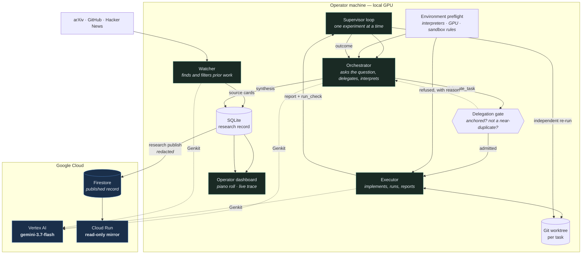

# CURI — Cumulative Research & Inquiry

## Abstract

The current wave of harness development and “autoresearch” pipelines has largely been designed to
maximize benchmark scores: propose a change, run the evaluator, keep it if the number improves,
and repeat. While this is a reasonable engineering loop when the benchmark is the specification. It is a poor
motivation for research. It invites Goodhart’s law: once a measure becomes a target, it ceases to
be a good measure. In practice, these pipelines often devolve into hyperparameter optimization. For the most part, I view this as an irresponsible use of an LLM's capabilities, since well-established algorithms already exist for tuning hyperparameters.

This project starts from that motivation. CURI takes a pure research direction: an
attempt to build an autonomous system whose basic unit is not a score improvement but an
investigation. It starts with a question and competing explanations, uses experiments as evidence,
records what the evidence supports or rules out, and leaves every result bounded by the conditions
actually tested. A negative, bounded or inconclusive result is still a finding. The aim is a
cumulative research record that becomes clearer and more useful over time.

This project is also partly inspired by Terence Tao’s essay [*Mathematics in the age of AI*](https://arxiv.org/abs/2608.16753).
Tao’s argument is to look beyond the capabilities question of whether AI can perform research-level
tasks, and ask what goals and values research should preserve when those capabilities arrive. We
follow that philosophy here. The runtime makes those values operational: research questions are
anchored in prior evidence; competing explanations are kept visible; claims stay within their
evidence; decisive checks are independently rerun; and the system is allowed to stop when more
activity would not produce more understanding. The point is not to make an agent look autonomous.
It is to test whether an autonomous process can produce research that another person can inspect,
question and build on.

In an unattended run on a consumer GPU, the prototype produced four findings across four research
threads, including one that **refuted its own hypothesis** and one that recorded a **wall-clock
slowdown** as a real result. The rest of this document describes the runtime and the constraints
that make those findings possible.

**Live mirror:** https://research-mirror-qdqttyl3jq-uc.a.run.app

---

## Architecture



**The loop:** the watcher admits prior work → the orchestrator picks one unresolved question and
writes a brief → a gate refuses briefs that cite no evidence or repeat an earlier study → the
executor implements it in an isolated git worktree → the runtime **independently re-runs** every
decisive check → the orchestrator interprets the result into an outcome, and material findings
into a synthesis that later evidence can supersede.

---

## Research vs Benchmark Chasing

An optimization loop can be useful when its objective is the specification. Research is different:
the goal is not simply to produce a larger number, but to learn something that survives scrutiny.
The runtime encodes that distinction in its control flow and research record:

| Mechanism | Enforcement |
|---|---|
| No leaderboard or incumbent | The scheduler does not read a score; it chooses tasks from unresolved questions |
| Every task is anchored in evidence | Once a direction has evidence, a brief with no existing `COMP`/`OUT`/`SRC`/`SYN` identifier is **refused** |
| Repeated work must explain itself | A brief ≥75% identical to an earlier task is **refused** unless it names that task and explains which question the new experiment addresses |
| Claims stay within their evidence | Every outcome states its envelope — models, context lengths, hardware, sample size and untested regimes |
| Negative results still count | `refuted`, `bounded` and `inconclusive` are terminal research outcomes, not errors |
| Understanding accumulates | Syntheses attach to research threads and can be superseded by better evidence; no synthesis is treated as final |
| Stopping is a valid result | The orchestrator can pause a direction when it judges a milestone reached instead of manufacturing work |

These checks are part of the record. A refusal is returned as runtime feedback and appears in the
orchestrator’s next context, so an unproductive move can be corrected rather than repeated.

---

## Continuous research without busywork

An autonomous research process should not stay active for appearance’s sake. If there is no good
next question, the right action is to wait or stop, rather than invent a task (also for the sake of token expenditure).

The runtime therefore runs when there is a question or new evidence to consider, and becomes almost idle when
there is neither. This is a property of the runtime, not an instruction in the prompt: no prompt
tells the model to keep going, and `pause_research` remains an available outcome at any time.

The orchestrator is the research decision-maker: it asks questions, delegates experiments and
interprets results. The supervisor is the outer runtime loop: it schedules the other roles,
enforces stops and spend limits, and decides whether the process should wait, exit or resume.
On each iteration, a queued task goes to the executor; when there is no queued task, the supervisor
gives the orchestrator one turn. After that turn returns without a new task, the supervisor follows
the state of the run:

| the loop returned | what the supervisor does |
|---|---|
| operator stop, or the spend ceiling was reached | exit |
| the orchestrator paused, continuous mode off | exit; the pause stands |
| the orchestrator paused, continuous mode on | resume the direction after waiting |
| nothing delegated this turn | wait |

A pause and an idle turn carry the same signal: nothing is worth doing right now. Both use the same
backoff curve, doubling from one minute to a thirty-minute ceiling:

```
1 → 2 → 4 → 8 → 16 → 30 minutes, then capped
```

**The wait resets to one minute as soon as anything happens in the direction**: a source is
admitted, a task is delegated or returned, an outcome is recorded, a synthesis is written, or a
delegation is refused. Ten quiet hours therefore cost about two dozen orchestrator turns rather
than a paid poll every few seconds.

In practice, the watcher becomes a source of wake-ups rather than a polling timer. When the
orchestrator exhausts its current questions, it pauses, is taken up again, pauses again, and the
interval stretches to half an hour. When the watcher admits a paper, it appends an event, the wait
snaps back to a minute, and the orchestrator wakes to weigh the new evidence. **Research resumes
because evidence arrived, not because a timer fired.**

Continuous mode is controlled outside the model: use `research continuous` to enable it and
`--off` to make a pause final. Either way, the pause and the reasoning behind it remain in the
record.

---


## Features

- **Autonomous research loop** — watcher, orchestrator and executor, one experiment at a time.
- **Independent verification** — every `run_check` the executor makes is re-run by the runtime
  itself, so a result is never taken on the agent's word.
- **Environment preflight** — the runtime measures interpreters, CUDA, VRAM and the command
  sandbox once and hands the same verified sheet to both agents, so no research turn is spent
  rediscovering the machine.
- **Attempt continuity** — a task keeps one git worktree across attempts. A provider error or an
  operator restart resumes into the work already on disk instead of discarding it.
- **Full execution observability** — a piano roll showing where wall-clock time actually went
  (reasoning, each tool call, model wait, errors) and a searchable live agent trace.
- **Honest cost accounting** — usage is metered per model call across the whole tool loop, with
  reasoning tokens counted, and a runtime-adjustable spend ceiling.
- **Publishable record** — a redacted research record published to Firestore and served by a
  read-only Cloud Run mirror.

## Technologies

| Layer | Choice |
|---|---|
| Model | **Gemini 3.7 Flash** via **Vertex AI** |
| Agent framework | **Genkit** (`genkit`, `@genkit-ai/google-genai`) — tools, streaming, model middleware |
| Cloud infrastructure | **Firestore** (published record), **Cloud Run** (public mirror), Cloud Build, Artifact Registry |
| Runtime | Node.js 22, TypeScript, better-sqlite3, git worktrees |
| Experiments | Python 3.10, PyTorch 2.5 + CUDA 12.1, Hugging Face Transformers |
| Dashboard | Dependency-free HTML with `marked` + KaTeX served locally |

## Data sources

The current watcher retrieves from **arXiv**, **GitHub** and **Hacker News** directly — the model
never performs retrieval itself. Each source is read and judged for relevance before admission, and
admitted sources are cited by identifier in the briefs and syntheses that use them. Other domains
may need different sources or source adapters; the research loop does not depend on this particular
set of sources.

---

## Spin-up

The runtime is local-first: **bring your own API key in `.env` and it runs on your machine.**
Nothing about the research loop needs a cloud account. The Google Cloud pieces — the published
record and its public mirror — are an optional layer on top, and everything below works without
them.

The runtime is intended to be reusable across research domains. The core loop handles questions,
evidence, delegation, execution and synthesis; a domain supplies the experiment-specific contract,
such as its data, evaluator, replication policy and resource requirements. The attention domain is
the example we tested end to end, so the findings later in this document should not be read as
evidence that every other domain has already been validated.

### Prerequisites

- Node.js 22+ and git
- An API key from any one supported provider
- Python 3.10 with PyTorch for GPU experiments — optional, and only for experiments that measure
  models on hardware. Directions that are analytical or source-driven do not need it.

These are the runtime prerequisites. An individual domain may add its own requirements, such as
datasets, packages, compilers, hardware or time-indexed data.

### Configure a provider

```bash
npm install
cp .env.example .env
```

Fill in whichever provider you have a key for. `AR_MODEL` selects the model on all three:

| `AR_MODEL_PROVIDER` | Credential | Example `AR_MODEL` |
|---|---|---|
| `gemini-api` | `GEMINI_API_KEY` — free tier at [aistudio.google.com](https://aistudio.google.com/apikey) | `gemini-3.7-flash` |
| `vertex-ai` | `VERTEX_API_KEY` (express mode), or Application Default Credentials + `GOOGLE_CLOUD_PROJECT` | `gemini-3.7-flash` |
| `openrouter` | `OPENROUTER_API_KEY` | any OpenRouter model id |
| `openai-compatible` | none — set `AR_MODEL_BASE_URL` | any model your server lists |

```
AR_MODEL_PROVIDER=gemini-api
GEMINI_API_KEY=<your key>
AR_MODEL=gemini-3.7-flash
AR_MAX_COST_USD=20
```

Any OpenAI-compatible server works through the last row — a local vLLM or Ollama, or one on another
machine. Point `AR_MODEL_BASE_URL` at its `/v1` endpoint and set `AR_MODEL` to the name it serves.
Inference you host costs nothing per token, so it is recorded as zero spend rather than charged at
the list price of a hosted model; explicit rate overrides still win if you want to price it.

Values already in the real environment always win over the file, so the same code runs unchanged in
the cloud, where configuration arrives as service environment variables. `.env` is untracked and
must stay that way.

```bash
npx tsx src/cli.ts doctor        # checks the credential, the model and the toolchain
```

### Run a direction

```bash
npx tsx src/cli.ts research preflight --refresh     # measure this machine
npx tsx src/cli.ts research init   --direction my-direction --title "My research direction"   --brief "What should be investigated and why"   --domain domains/attention.domain.json   --topic "search topic for the watcher"

npx tsx src/cli.ts research supervisor start        # the research loop
npx tsx src/cli.ts research watch start             # literature intake
npx tsx src/cli.ts research dashboard start --port 7331
```

The example above uses the included attention domain, which is also the domain used for the findings
described later in this document. To investigate another domain, provide its own domain contract
and adjust the direction brief, topic, data and environment accordingly. The core loop is intended
to be reusable across domains, but each domain still needs an evaluator and replication policy that
are appropriate to its claims; loading a domain file is not by itself evidence that the domain has
been scientifically validated.

Open http://127.0.0.1:7331. Useful controls:

```bash
npx tsx src/cli.ts research status                  # what is running
npx tsx src/cli.ts research budget --max 40         # spend ceiling, applied live
npx tsx src/cli.ts research continuous              # keep going past a pause
npx tsx src/cli.ts research stop --all              # stop everything
```

The spend ceiling is enforced before every orchestrator turn and every watcher sweep, so an
unattended run has a hard upper bound you set yourself.

State lives in `.curi/`. A project created before the rename keeps its `.autoresearch/`
directory, because moving it is a migration rather than a rename — the store records absolute
attempt paths and git registers each worktree by absolute path. `research migrate-state
--dry-run` reports what would change; without the flag it moves the directory, rewrites the
recorded paths and repairs the worktrees, and it refuses to run while any daemon is live.

### Optional: publish the record and a public mirror

Only needed if you want the research record readable outside your machine. The mirror is read-only
and scales to zero, so an idle deployment costs nothing.

```bash
gcloud auth application-default login
gcloud services enable firestore.googleapis.com run.googleapis.com   artifactregistry.googleapis.com cloudbuild.googleapis.com

# Firestore in Native mode, once per project
curl -X POST -H "Authorization: Bearer $(gcloud auth print-access-token)"   -H "Content-Type: application/json"   "https://firestore.googleapis.com/v1/projects/$PROJECT/databases?databaseId=(default)"   -d '{"locationId":"us-central1","type":"FIRESTORE_NATIVE"}'

npx tsx src/cli.ts research publish --dry-run       # inspect what would be published
npx tsx src/cli.ts research publish --project $PROJECT
gcloud builds submit --config cloudbuild.mirror.yaml --project $PROJECT
```

### Why experiments run on local hardware

Experiments execute on whatever GPU the machine has, not on a cloud accelerator. That was a
deliberate cost decision rather than a missing feature: the measured bottleneck in this system is
model latency, not device throughput: 3442s of tool time against 5695s waiting on the model, with
the local GPU at 33% utilization. So renting an accelerator would have consumed a limited credit
grant to keep a faster card idle for two thirds of the run. The credits went to the model calls
that were actually the constraint.

Nothing in the design prevents it. The executor runs ordinary Python in a git worktree, so pointing
it at a cloud VM with a larger GPU is a matter of running the runtime there; the environment
preflight measures whatever devices it finds and the orchestrator fixes experiment scale against
that sheet. A larger card widens the model sizes and context lengths a direction can reach, which
is exactly the limitation recorded below.

### Tests

```bash
npm test        # 111 tests
npm run typecheck
```

---

## Repository layout

```
src/research/     the research runtime: supervisor, orchestrator, executor,
                  watcher, delegation gate, preflight, publisher, mirror
src/worker/       Genkit worker — tools, sandbox, metering, trace
src/config/       runtime configuration, environment loading, doctor
src/store/        cross-project memory shared with the worker
prompts/          the agent prompts; researcher.md carries the research policy
test/             73 tests, including the anti-hill-climbing invariants
deploy/           minimal dependency set for the hosted mirror
docs/             design notes and direction briefs
```

The previous architecture — a campaign harness that optimised a score — is kept
under `pi-extension/legacy-harness/` and is not reachable from this codebase.

---

## What the mirror publishes, and what it does not

Publishing is a trust boundary, so the record is narrowed rather than filtered:

- **Published:** findings, verdicts, syntheses and their provenance, task briefs, run metadata,
  the verified checks and their exit codes, admitted sources, and the agent traces — the reasoning
  and the code each agent wrote.
- **Never published:** agent prompts, worktree contents, the environment sheet, and any local
  filesystem path. Prompts embed the preflight sheet and worktree paths, so they are omitted
  entirely rather than scrubbed.
- **Withheld by default:** tool *output*. A trace step records how much a check printed and whether
  it failed, but not what it printed — that is unbounded machine output rather than research.
  `research publish --with-tool-output` includes it, redacted and checked like anything else.

### Redaction is a gate, not a filter

A redactor is a guess about what a leak looks like, and it fails silently when the guess is wrong.
So nothing leaves the machine on the strength of a scrub alone. Publishing runs in two stages:

1. **Redact.** Home paths in both slash directions, `file://` URLs, emails, IP addresses and
   credential shapes are replaced. Drive letters are matched with a lookbehind so the `s:` in
   `https:` is not mistaken for one — without it every cited source URL would be replaced by a
   path marker.
2. **Verify, then refuse.** The assembled record is walked field by field and checked against
   identifiers read from the running environment: the real username, hostname, home directory, and
   the value of every credential-shaped variable. **A field that still matches stops the publish.**
   Nothing is written — not the clean documents either.

Because the check runs on the *assembled* record rather than on each producer, no part of the
system has to be trusted to have remembered to redact. A pattern the redactor fails to anticipate
costs a refused publish, never a leak. Within a trace, a single failing step is replaced by a
visible withheld marker instead of failing the whole record, so the gap is legible rather than
silent. Findings name the field path and which identifier matched, never the surrounding text, so
the log of a refusal is not itself a leak.

```
$ curi research publish --dry-run
identifierFindings: 0
findingPaths: []
```

That check is part of every publish, including the automatic ones — it is not an audit somebody
has to remember to run. `AR_PUBLISH_TRACE=off` (or `--no-trace`) publishes the timeline alone.

The mirror process is isolated by its import graph as well: it cannot reach the SQLite store, the
worker or the supervisor, rejects any non-GET request, and exposes no control endpoint. Tests
enforce this.

---

## Findings and learnings

The results in this section come from the attention/KV-cache example. Running it on a single RTX
3060 Ti produced four findings across four research threads, then paused after judging that it had
reached a milestone. These are bounded results from one example domain, not general claims about
AI systems or research in general.

### Results from the example run

- **Heuristic KV-cache eviction is causally blind to unasked questions** (`bounded`). H2O's
  cumulative-attention retention scored **0% on non-local needle retrieval at 50% cache budget —
  indistinguishable from random eviction**. During prefill, filler tokens do not attend to an
  isolated fact, so attention mass cannot mark it. This refuted the study's own leading hypothesis,
  and it is only a meaningful statement because the design included a random-eviction control.
- **Speculative decoding can be a wall-clock loss at healthy acceptance** (`supported`). With
  α = 38–54%, throughput was *slower* than plain autoregressive decoding, because per-token latency
  tracks transformer **layer depth** rather than parameter count (0.5B/24 layers: 39.4 ms/tok vs
  1.5B/28 layers: 43.9 ms/tok).
- **Key and Value quantization errors differ in kind, not degree** (`supported`). Value error is
  additive through a row-stochastic attention matrix; Key error passes through a softmax and
  disperses attention. Asymmetric K-INT8/V-INT4 held retrieval at 4-bit Value precision.
- **A regime dispatcher composing all three** (`supported`) — an integration task, not another
  sweep.

### How to interpret these results

These should not be presented as novel discoveries. Three of the four reproduce results that
already exist in the literature: the causal blindness of attention-mass eviction is the failure
mode StreamingLLM and later needle-retrieval work describe for H2O-style policies; the speculative
decoding result is the standard acceptance-rate/latency crossover inequality, reached through
measurement rather than algebra; and the K/V asymmetry is the finding KIVI reports and uses to
motivate per-channel key quantization. The dispatcher that composes them is an integration, not a
new mechanism.

That is the honest result of a system running on a consumer GPU over a few days. The value of the
run is not novelty; it is the transparent, independently checked process by which the findings were
reached and the fact that the record preserves what the experiments cost:

- They were **independently re-derived**, not retrieved. The eviction result came out of a design
  that included a random-eviction control, which is why "0% at 50% budget" is a claim about the
  policy rather than about the task being hard. Re-verification on hardware you control is
  legitimate scientific output, and it is the part of published work that is most often absent.
- The eviction study **refuted its own leading hypothesis** and was recorded as `bounded` rather
  than rewritten into a success. A hill-climbing loop has no way to produce that outcome.
- The speculative-decoding finding is a **negative result** — the technique lost wall-clock time at
  a healthy acceptance rate — and it survived into the record instead of being discarded as a
  failed run.

The contribution this repository claims is the **research process**, not the four findings: a
delegation gate that refuses untethered and near-duplicate briefs, syntheses that accumulate and
can be superseded rather than overwritten, per-call cost accounting, and an agent that is allowed
to stop when it has nothing worth asking. Whether this process can produce a finding that is *not*
already in the literature remains an open question about scale.

### Lessons from building the runtime

- **Model latency, not GPU throughput, was the bottleneck.** The run measured 3442 seconds of tool
  time against 5695 seconds waiting on the model, with the GPU at 33% utilisation. More compute buys
  *scope*, not speed.
- **Cost accounting has to cover the whole interaction.** Recording only the final model call
  undercounted input tokens **20×** and output **90×**, because a tool loop resends the conversation
  each turn and reasoning tokens arrive in a separate field.
- **Interruption is part of normal operation.** Provider errors, operator stops and preemption all
  happen. An interrupted attempt should be resumed rather than discarded, without charging it
  against the attempt budget.
- **A refusal has to explain itself.** Feedback is useful only if the orchestrator sees it; refused
  delegations are therefore surfaced in its next context rather than discarded.
- **Evidence needs calibrated language.** Left unconstrained, the orchestrator wrote "proved" and
  "established" from n=3 on a 0.5B model. Outcomes must state the envelope their evidence covers,
  and `supported` is reserved for claims whose falsifier was actually tested.

### Limits of the current evidence

- Findings are bounded to 0.5B–1.5B models at ≤4096 context on one consumer GPU. That is
  *simulated* memory pressure, not the long-context regime the direction ultimately targets.
- Sample sizes are small (n=3 per cell in the eviction study); the results indicate rather than
  establish.
- The eviction study measures the symptom, not the mechanism: it does not record whether the needle
  token survived eviction, so "evicted it" and "kept it but could not use it" remain
  undistinguished.
- The runtime is intended to support other domains, but this end-to-end campaign tested only the
  attention example. Other domains require their own evaluator, replication policy and domain review.
- The research loop runs locally because it needs a GPU and a persistent filesystem; only the
  record and its mirror are hosted.

---

## License

MIT. Bring your own API key and run it; see `LICENSE`.
