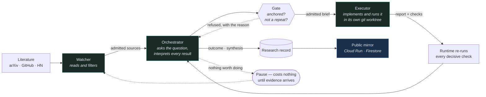
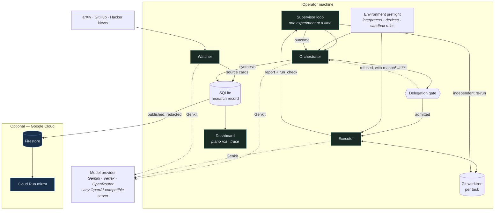

# CURI — Cumulative Research & Inquiry

## Abstract

The current wave of harness development and “autoresearch” pipelines has largely been designed to
maximize benchmark scores: propose a change, run the evaluator, keep it if the number improves,
and repeat. This is a reasonable engineering loop when the benchmark is the specification, but it is a poor
motivation for research. It invites Goodhart’s law: once a measure becomes a target, it ceases to
be a good measure. In practice, these pipelines often devolve into hyperparameter optimization. For the most part, I view this as an irresponsible use of an LLM's capabilities, since well-established algorithms already exist for tuning hyperparameters.

This project starts from that motivation. CURI takes a pure research direction: an
attempt to build an autonomous system whose basic unit is not a score improvement but an
investigation. It starts with a question and competing explanations, uses experiments as evidence,
records what the evidence supports or rules out, and leaves every result bounded by the conditions
actually tested. A negative, bounded or inconclusive result is still a finding. The aim is a
cumulative research record that becomes clearer and more useful over time.

This project is also partly inspired by Terence Tao’s essay [*Mathematics in the age of AI*](https://arxiv.org/abs/2608.16753).
Tao’s argument is to look beyond the capabilities question of whether AI can perform research-level
tasks, and ask what goals and values research should preserve when those capabilities arrive. We
follow that philosophy here. The runtime makes those values operational: research questions are
anchored in prior evidence; competing explanations are kept visible; claims stay within their
evidence; decisive checks are independently rerun; and the system is allowed to stop when more
activity would not produce more understanding. The point is not to make an agent look autonomous.
It is to test whether an autonomous process can produce research that another person can inspect,
question and build on.

In unattended runs on a consumer GPU and a DGX Spark, the prototype produced **21 recorded
outcomes** across two domains — including a thread that **refuted its own hypothesis** and another
that recorded a **wall-clock slowdown** as a real result. The rest of this document describes the
runtime and the constraints that make those findings possible.

**Live mirror:** https://research-mirror-qdqttyl3jq-uc.a.run.app

---

## Architecture



Three agents and one rule: **the orchestrator interprets every result before anything else is
delegated.** That is what makes the loop research rather than search — there is no path from a
result back to another experiment that does not pass through an interpretation.

**The loop:** the watcher admits prior work → the orchestrator picks one unresolved question and
writes a brief → a gate refuses briefs that cite no evidence or repeat an earlier study → the
executor implements it in an isolated git worktree → the runtime **independently re-runs** every
decisive check → the orchestrator interprets the result into an outcome, and material findings
into a synthesis that later evidence can supersede.

<details>
<summary>The same thing with the runtime's supporting parts</summary>



The supervisor is the outer loop: it schedules the roles, enforces the spend ceiling and stops, and
independently re-runs each decisive check before the orchestrator sees the result. The preflight
measures the machine by running it, so experiment scale is fixed against real devices rather than a
guess. Everything in the cloud box is optional; the runtime is complete without it.

</details>

---

## Research vs Benchmark Chasing

An optimization loop can be useful when its objective is the specification. Research is different:
the goal is not simply to produce a larger number, but to learn something that survives scrutiny.
The runtime encodes that distinction in its control flow and research record:

| Mechanism | Enforcement |
|---|---|
| No leaderboard or incumbent | The scheduler does not read a score; it chooses tasks from unresolved questions |
| Every task is anchored in evidence | Once a direction has evidence, a brief with no existing `COMP`/`OUT`/`SRC`/`SYN` identifier is **refused** |
| Repeated work must explain itself | A brief ≥75% identical to an earlier task is **refused** unless it names that task and explains which question the new experiment addresses |
| Claims stay within their evidence | Every outcome states its envelope — models, context lengths, hardware, sample size and untested regimes |
| Negative results still count | `refuted`, `bounded` and `inconclusive` are terminal research outcomes, not errors |
| Understanding accumulates | Syntheses attach to research threads and can be superseded by better evidence; no synthesis is treated as final |
| Stopping is a valid result | The orchestrator can pause a direction when it judges a milestone reached instead of manufacturing work |

These checks are part of the record. A refusal is returned as runtime feedback and appears in the
orchestrator’s next context, so an unproductive move can be corrected rather than repeated.

---

## Continuous research without busywork

An autonomous research process should not stay active for appearance’s sake. If there is no good
next question, the right action is to wait or stop, rather than invent a task (also for the sake of token expenditure).

The runtime therefore runs when there is a question or new evidence to consider, and becomes almost idle when
there is neither. This is a property of the runtime, not an instruction in the prompt: no prompt
tells the model to keep going, and `pause_research` remains an available outcome at any time.

The orchestrator is the research decision-maker: it asks questions, delegates experiments and
interprets results. The supervisor is the outer runtime loop: it schedules the other roles,
enforces stops and spend limits, and decides whether the process should wait, exit or resume.
On each iteration, a queued task goes to the executor; when there is no queued task, the supervisor
gives the orchestrator one turn. After that turn returns without a new task, the supervisor follows
the state of the run:

| the loop returned | what the supervisor does |
|---|---|
| operator stop, or the spend ceiling was reached | exit |
| the orchestrator paused, continuous mode off | exit; the pause stands |
| the orchestrator paused, continuous mode on | wait; resume only once evidence has arrived |
| nothing delegated this turn | wait |

**A pause is resumed by evidence, not by a clock.** Continuous mode takes a paused direction up
again only when something has arrived that could change the judgement: a source admitted, a task
returned, an outcome or synthesis recorded. Until then the pause stands and costs nothing.

That distinction is load-bearing, and it was learned the hard way. Resuming on a timer hands the
orchestrator the same context and asks it the same question, and given a turn it will record
*something* rather than nothing — a restated synthesis, a re-described component map. Closing one
of those outlets simply moved the repetition to the next. One direction spent most of its budget
pausing and resuming every ninety seconds.

An *idle* turn is different: the direction is still active and the orchestrator delegated nothing,
so the wait grows on a backoff curve instead.

```
1 → 2 → 4 → 8 → 16 → 30 minutes, then capped
```

**That wait resets only when the direction actually moves** — a source admitted, a task delegated
or returned, an outcome or synthesis recorded. Bookkeeping does not count, and neither does the
pause itself: an event the loop writes about its own scheduling must not persuade it that research
happened.

Three checks keep a turn from manufacturing that signal. A synthesis that repeats the standing
account without citing a new outcome is refused; a relationship whose description says what it
already said records nothing; a near-duplicate component is not created. Each refusal is written
back as feedback the orchestrator reads on its next turn, so it learns the move was empty rather
than repeating it blind.

In practice the watcher is what ends a pause. When the orchestrator exhausts its current questions
it pauses, and the direction then sits at no cost — no turns, no tokens — for as long as nothing
arrives. When the watcher admits a paper, that is evidence, and the orchestrator wakes to weigh it.
**Research resumes because evidence arrived, not because a timer fired.**

Measured on a live direction, the difference is about twelvefold: roughly $2.00 an hour before
these changes against $0.17 an hour after, while the number of recorded findings went up rather
than down.

Continuous mode is controlled outside the model: use `research continuous` to enable it and
`--off` to make a pause final. Either way, the pause and the reasoning behind it remain in the
record.

---


## Features

- **Autonomous research loop** — watcher, orchestrator and executor, one experiment at a time.
- **Independent verification** — every `run_check` the executor makes is re-run by the runtime
  itself, so a result is never taken on the agent's word.
- **Environment preflight** — the runtime measures interpreters, CUDA, VRAM and the command
  sandbox once and hands the same verified sheet to both agents, so no research turn is spent
  rediscovering the machine.
- **Attempt continuity** — a task keeps one git worktree across attempts. A provider error or an
  operator restart resumes into the work already on disk instead of discarding it.
- **Long-run context continuity** — Genkit tool loops are divided into auditable epochs after 24
  model turns or 60% of the model window. The same model writes a free-form Markdown checkpoint,
  complete message history stays local, and later epochs can retrieve exact archived details.
- **Full execution observability** — a piano roll showing where wall-clock time actually went
  (reasoning, each tool call, model wait, errors) and a searchable live agent trace.
- **Honest cost accounting** — usage is metered per model call across the whole tool loop, with
  reasoning tokens counted, and a runtime-adjustable spend ceiling.
- **Publishable record** — a redacted research record published to Firestore and served by a
  read-only Cloud Run mirror.

## Technologies

| Layer | Choice |
|---|---|
| Model | **Gemini 3.7 Flash** via **Vertex AI** |
| Agent framework | **Genkit** (`genkit`, `@genkit-ai/google-genai`, `@genkit-ai/compat-oai`) — streaming, registered tools, manual SDK tool resolution, serializable message history, and model middleware |
| Cloud infrastructure | **Firestore** (published record), **Cloud Run** (public mirror), Cloud Build, Artifact Registry |
| Runtime | Node.js 22, TypeScript, better-sqlite3, git worktrees |
| Experiments | Python 3.10, PyTorch 2.5 + CUDA 12.1, Hugging Face Transformers |
| Dashboard | Dependency-free HTML with `marked` + KaTeX served locally |

## Data sources

The current watcher retrieves from **arXiv**, **GitHub** and **Hacker News** directly — the model
never performs retrieval itself. Each source is read and judged for relevance before admission, and
admitted sources are cited by identifier in the briefs and syntheses that use them. Other domains
may need different sources or source adapters; the research loop does not depend on this particular
set of sources.

---

## Spin-up

The runtime is local-first: **bring your own API key in `.env` and it runs on your machine.**
Nothing about the research loop needs a cloud account. The Google Cloud pieces — the published
record and its public mirror — are an optional layer on top, and everything below works without
them.

The runtime is intended to be reusable across research domains. The core loop handles questions,
evidence, delegation, execution and synthesis; a domain supplies the experiment-specific contract,
such as its data, evaluator, replication policy and resource requirements. The attention domain is
the primary example used in the setup below; the strategy-generalization direction is a second,
local-only run described later.

### Prerequisites

- Node.js 22+ and git
- An API key from any one supported provider
- Python 3.10 with PyTorch for GPU experiments — optional, and only for experiments that measure
  models on hardware. Directions that are analytical or source-driven do not need it.

These are the runtime prerequisites. An individual domain may add its own requirements, such as
datasets, packages, compilers, hardware or time-indexed data.

### Configure a provider

```bash
npm install
cp .env.example .env
```

Fill in whichever provider you have a key for. `AR_MODEL` selects the model on all three:

| `AR_MODEL_PROVIDER` | Credential | Example `AR_MODEL` |
|---|---|---|
| `gemini-api` | `GEMINI_API_KEY` — free tier at [aistudio.google.com](https://aistudio.google.com/apikey) | `gemini-3.7-flash` |
| `vertex-ai` | `VERTEX_API_KEY` (express mode), or Application Default Credentials + `GOOGLE_CLOUD_PROJECT` | `gemini-3.7-flash` |
| `openrouter` | `OPENROUTER_API_KEY` | any OpenRouter model id |
| `openai-compatible` | none — set `AR_MODEL_BASE_URL` | any model your server lists |

```
AR_MODEL_PROVIDER=gemini-api
GEMINI_API_KEY=<your key>
AR_MODEL=gemini-3.7-flash
AR_MAX_COST_USD=20
```

Any OpenAI-compatible server works through the last row — a local vLLM or Ollama, or one on another
machine. Point `AR_MODEL_BASE_URL` at its `/v1` endpoint and set `AR_MODEL` to the name it serves.
Inference you host costs nothing per token, so it is recorded as zero spend rather than charged at
the list price of a hosted model; explicit rate overrides still win if you want to price it.

For a fully local deployment — a model served on a second machine, no cloud calls at all, and
research state kept on the PC — see [`docs/local-deepseek-spark.md`](docs/local-deepseek-spark.md).
It documents the no-cloud boundary, provider-independent web search, and the launcher that starts
and stops the model server over SSH.

Values already in the real environment always win over the file, so the same code runs unchanged in
the cloud, where configuration arrives as service environment variables. `.env` is untracked and
must stay that way.

```bash
npx tsx src/cli.ts doctor        # checks the credential, the model and the toolchain
```

### Run a direction

```bash
npx tsx src/cli.ts research preflight --refresh     # measure this machine
npx tsx src/cli.ts research init   --direction my-direction --title "My research direction"   --brief "What should be investigated and why"   --domain domains/attention.domain.json   --topic "search topic for the watcher"

```

A domain file is a direction note, not a configuration: the runtime records its path and never
parses it. `domains/` ships the two used here — one for transformer inference, one for strategy
generalization — and writing your own is a matter of stating the question, the environment and the
invariants a result has to respect.

```bash
npx tsx src/cli.ts research supervisor start        # the research loop
npx tsx src/cli.ts research watch start             # literature intake
npx tsx src/cli.ts research dashboard start --port 7331
```

The example above uses the included attention domain, which is also the domain behind the published
Cloud Run record. The strategy-generalization direction is a second domain run locally on the DGX
Spark and is not published to Firestore. To investigate another domain, provide its own domain
contract and adjust the direction brief, topic, data and environment accordingly. The core loop is
intended to be reusable across domains, but each domain still needs an evaluator and replication
policy appropriate to its claims; loading a domain file is not by itself evidence that the domain
has been scientifically validated.

Open http://127.0.0.1:7331. Useful controls:

```bash
npx tsx src/cli.ts research status                  # what is running
npx tsx src/cli.ts research budget --max 40         # spend ceiling, applied live
npx tsx src/cli.ts research continuous              # keep going past a pause
npx tsx src/cli.ts research stop --all              # stop everything
```

The spend ceiling is enforced before every orchestrator turn and every watcher sweep, so an
unattended run has a hard upper bound you set yourself.

State lives in `.curi/`. A project created before the rename keeps its `.autoresearch/`
directory, because moving it is a migration rather than a rename — the store records absolute
attempt paths and git registers each worktree by absolute path. `research migrate-state
--dry-run` reports what would change; without the flag it moves the directory, rewrites the
recorded paths and repairs the worktrees, and it refuses to run while any daemon is live.

### Optional: publish the record and a public mirror

Only needed if you want the research record readable outside your machine. The mirror is read-only
and scales to zero, so an idle deployment costs nothing.

```bash
gcloud auth application-default login
gcloud services enable firestore.googleapis.com run.googleapis.com   artifactregistry.googleapis.com cloudbuild.googleapis.com

# Firestore in Native mode, once per project
curl -X POST -H "Authorization: Bearer $(gcloud auth print-access-token)"   -H "Content-Type: application/json"   "https://firestore.googleapis.com/v1/projects/$PROJECT/databases?databaseId=(default)"   -d '{"locationId":"us-central1","type":"FIRESTORE_NATIVE"}'

npx tsx src/cli.ts research publish --dry-run       # inspect what would be published
npx tsx src/cli.ts research publish --project $PROJECT
gcloud builds submit --config cloudbuild.mirror.yaml --project $PROJECT
```

### Why experiments run on local hardware

Experiments execute on whatever GPU the machine has, not on a cloud accelerator. That was a
deliberate cost decision rather than a missing feature: the measured bottleneck in this system is
model latency, not device throughput: 3442s of tool time against 5695s waiting on the model, with
the local GPU at 33% utilization. So renting an accelerator would have consumed a limited credit
grant to keep a faster card idle for two thirds of the run. The credits went to the model calls
that were actually the constraint.

Nothing in the design prevents it. The executor runs ordinary Python in a git worktree, so pointing
it at a cloud VM with a larger GPU is a matter of running the runtime there; the environment
preflight measures whatever devices it finds and the orchestrator fixes experiment scale against
that sheet. A larger card widens the model sizes and context lengths a direction can reach, which
is exactly the limitation recorded below.

### Tests

```bash
npm test        # 148 tests
npm run typecheck
```

---

## Repository layout

```
src/research/     the research runtime: supervisor, orchestrator, executor,
                  watcher, delegation gate, preflight, publisher, mirror
src/worker/       Genkit worker — tools, sandbox, metering, trace
src/config/       runtime configuration, environment loading, doctor
src/store/        cross-project memory shared with the worker
prompts/          the agent prompts; researcher.md carries the research policy
test/             73 tests, including the anti-hill-climbing invariants
deploy/           minimal dependency set for the hosted mirror
docs/             design notes and direction briefs
```

The previous architecture — a campaign harness that optimised a score — is kept
under `pi-extension/legacy-harness/` and is not reachable from this codebase.

---

## What the mirror publishes, and what it does not

Publishing is a trust boundary, so the record is narrowed rather than filtered:

- **Published:** findings, verdicts, syntheses and their provenance, task briefs, run metadata,
  the verified checks and their exit codes, admitted sources, and the agent traces — the reasoning
  and the code each agent wrote.
- **Never published:** agent prompts, worktree contents, the environment sheet, and any local
  filesystem path. Prompts embed the preflight sheet and worktree paths, so they are omitted
  entirely rather than scrubbed.
- **Withheld by default:** tool *output*. A trace step records how much a check printed and whether
  it failed, but not what it printed — that is unbounded machine output rather than research.
  `research publish --with-tool-output` includes it, redacted and checked like anything else.

### Redaction is a gate, not a filter

A redactor is a guess about what a leak looks like, and it fails silently when the guess is wrong.
So nothing leaves the machine on the strength of a scrub alone. Publishing runs in two stages:

1. **Redact.** Home paths in both slash directions, `file://` URLs, emails, IP addresses and
   credential shapes are replaced. Drive letters are matched with a lookbehind so the `s:` in
   `https:` is not mistaken for one — without it every cited source URL would be replaced by a
   path marker.
2. **Verify, then refuse.** The assembled record is walked field by field and checked against
   identifiers read from the running environment: the real username, hostname, home directory, and
   the value of every credential-shaped variable. **A field that still matches stops the publish.**
   Nothing is written — not the clean documents either.

Because the check runs on the *assembled* record rather than on each producer, no part of the
system has to be trusted to have remembered to redact. A pattern the redactor fails to anticipate
costs a refused publish, never a leak. Within a trace, a single failing step is replaced by a
visible withheld marker instead of failing the whole record, so the gap is legible rather than
silent. Findings name the field path and which identifier matched, never the surrounding text, so
the log of a refusal is not itself a leak.

```
$ curi research publish --dry-run
identifierFindings: 0
findingPaths: []
```

That check is part of every publish, including the automatic ones — it is not an audit somebody
has to remember to run. `AR_PUBLISH_TRACE=off` (or `--no-trace`) publishes the timeline alone.

The mirror process is isolated by its import graph as well: it cannot reach the SQLite store, the
worker or the supervisor, rejects any non-GET request, and exposes no control endpoint. Tests
enforce this.

---

## Findings and learnings

Two directions have been run, on two machines, in two domains. Both are stopped and every number
below is read from their records. A full account is in [`docs/run-report.md`](docs/run-report.md);
these are bounded results from two example domains, not general claims about AI systems or research.

| | Attention & KV-cache | Strategy generalization |
|---|---|---|
| Machine | Windows, RTX 3060 Ti | DGX Spark (GB10), Ubuntu aarch64 |
| Wall clock | ~43 h | ~11 h |
| Runs · spend | 125 · **$39.60** | 89 · **$20.53** |
| Outcomes | **17** (12 supported, 3 bounded, 1 refuted, 1 inconclusive) | **4** (3 supported, 1 bounded) |
| Syntheses · threads | 28 · 4 | 21 · 5 |
| Sources admitted | 41 | 14 |

Combined: 214 runs, $60.13, 71.3M input tokens, 21 recorded outcomes. The second direction is what
the first cannot show — that the runtime is not built around one problem. It studies when a trading
strategy found in history keeps its edge outside the window it was found in, with a decade of later
data deliberately withheld from the machine the agents run on.

### Results from the example run

- **Heuristic KV-cache eviction is causally blind to unasked questions** (`bounded`). H2O's
  cumulative-attention retention scored **0% on non-local needle retrieval at 50% cache budget —
  indistinguishable from random eviction**. During prefill, filler tokens do not attend to an
  isolated fact, so attention mass cannot mark it. This refuted the study's own leading hypothesis,
  and it is only a meaningful statement because the design included a random-eviction control.
- **Speculative decoding can be a wall-clock loss at healthy acceptance** (`supported`). With
  α = 38–54%, throughput was *slower* than plain autoregressive decoding, because per-token latency
  tracks transformer **layer depth** rather than parameter count (0.5B/24 layers: 39.4 ms/tok vs
  1.5B/28 layers: 43.9 ms/tok).
- **Key and Value quantization errors differ in kind, not degree** (`supported`). Value error is
  additive through a row-stochastic attention matrix; Key error passes through a softmax and
  disperses attention. Asymmetric K-INT8/V-INT4 held retrieval at 4-bit Value precision.
- **A regime dispatcher composing all three** (`supported`) — an integration task, not another
  sweep.
- **Randomized-Hadamard rotation fails to prevent key quantization damage** (`refuted`) — the one
  outright refutation, and the outcome a score-maximizing loop has no way to record.

Twelve further outcomes cover prompt-lookup speculation, prefill-pressure adaptive scheduling,
failure propagation between low-bit KV quantization and speculative verification, prefix-cache
reuse, and spectral transform coding.

From the finance direction, its first experiment swept search intensity from 1 to 5,000 strategy
variants:

| variants examined | best in-sample Sharpe | out-of-sample @ 0 bps | out-of-sample @ 10 bps |
|---|---|---|---|
| 1 | 0.78 | 0.36 | 0.07 |
| 100 | 3.07 | 0.87 | 0.12 |
| 1,000 | 3.81 | 0.64 | **−0.44** |
| 5,000 | 4.11 | 0.43 | **−0.89** |

Search harder, look better in sample, do worse out of sample — and once 10 bps of cost is charged,
the best-looking strategy of 5,000 loses money. Nothing has been evaluated against the withheld
decade: that is an operator step, because an agent that could reach the holdout would make the
number meaningless.

### How to interpret these results

These results should not be presented as novel discoveries. The highlighted attention results
largely reproduce known behavior: attention-mass eviction's causal blindness appears in
StreamingLLM and later needle-retrieval work; the speculative-decoding result follows the standard
acceptance-rate/latency tradeoff; and the K/V asymmetry is reported by KIVI. The regime dispatcher
and the other integrations are engineering results, not new mechanisms.

The strategy-generalization direction is an early domain demonstration, not a trading system. Its
purpose is to test whether a strategy that looks good in-sample survives outside the period in which
it was found. Its results remain provisional and should not be treated as investment evidence.

The contribution this repository claims is the **research process**, not the findings: a delegation
gate that refuses untethered and near-duplicate briefs, syntheses that accumulate and can be
superseded, independently checked outcomes, per-call cost accounting, and an agent that is allowed
to stop when it has nothing worth asking. Whether this process can produce a finding that is *not*
already in the literature remains an open question about scale.

### What the runs taught us

- **Model latency, not GPU throughput, was the bottleneck.** The runs spent far more time waiting
  on the model than using the GPU. More compute buys *scope*, not necessarily speed.
- **Cost accounting has to cover the whole interaction.** A tool loop resends the conversation and
  reasoning tokens arrive separately, so recording only the final model call substantially
  undercounts usage.
- **Long-running agent work needs checkpoints and resumability.** Tool requests, model responses and
  scientific state have to survive interruption without turning transport failures into new
  experiments.
- **Runtime state must distinguish progress from activity.** A pause or idle turn should not trigger
  a paid repetition of the same question; new evidence should be what wakes the system.
- **Evidence needs calibrated language.** Outcomes state the envelope their evidence covers, and
  `supported` is reserved for claims whose falsifier was actually tested.

The detailed implementation postmortem is in [`docs/build-story.md`](docs/build-story.md).

### What these runs do—and do not—show

- The attention findings are bounded to 0.5B–1.5B models at ≤4096 context on one RTX 3060 Ti. This
  is simulated memory pressure, not the long-context regime the direction ultimately targets.
- Sample sizes are small; the results indicate rather than establish.
- The eviction study measures the symptom, not the mechanism: it does not distinguish a needle token
  being evicted from being retained but unusable.
- The runtime has now been exercised in two domains, but each new domain still requires its own
  evaluator, replication policy and domain review.
- Experiments run on the machine that holds the data and hardware they measure; only the record and
  its mirror are hosted. The strategy direction also shows that a GPU is not universally required.
- The strategy results contain an unresolved internal inconsistency, and the withheld decade has not
  been evaluated. Those numbers should not be quoted as validated trading results.
- Process isolation reduces the executor's capabilities but is not a hardened hostile-code sandbox;
  genuine isolation requires a separate user or container.

---

## License

MIT. Bring your own API key and run it; see `LICENSE`.
