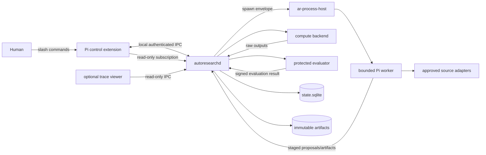

# Pi Autoresearch — Technical Implementation Specification

Status: implementation baseline  
Version: 0.1  
Date: 2026-08-20  
Depends on: [01-pi-autoresearch-design.md](./01-pi-autoresearch-design.md) and [02-adversarial-autoresearch-audit.md](./02-adversarial-autoresearch-audit.md)

## 0. Purpose and decision status

This document turns the research and product design into an implementable system. It specifies process boundaries, packages, APIs, state, schemas, lifecycle transitions, Pi integration, permissions, recovery, tests, and delivery order.

The normative words **MUST**, **MUST NOT**, **SHOULD**, and **MAY** have their usual requirements meaning. Where this document conflicts with the earlier design, this document controls implementation; the earlier documents control motivation and audit rationale.

The initial release is a local-first Pi package named `pi-autoresearch`. It is not an endless prompt, a recursively spawning swarm, or a general personal-assistant memory system. It is a durable research control plane which invokes bounded Pi sessions as untrusted reasoning workers.

### 0.1 Decisions fixed for the first implementation

| Concern | Decision |
|---|---|
| Core language | TypeScript on Node.js 22.19+ |
| Canonical state | One SQLite database per project, WAL mode, one writer |
| Long-lived owner | External `autoresearchd` daemon, never the interactive Pi extension |
| Pi integration | Thin extension for commands, read-only tools, status, and trace UI |
| Model workers | Fresh isolated Pi SDK runtime in a child process; no ambient extensions, skills, context files, or observational memory |
| Process ownership | Small `ar-process-host` helper; Rust is permitted only for OS process-tree primitives and durable child ownership |
| IPC | Same-user local named pipe/Unix socket using length-prefixed JSON messages |
| Default concurrency | One reasoning worker and one admitted experiment at a time |
| Initial hard cap | Four reasoning workers per campaign, unavailable until the serial system passes its gates |
| Delegation | Supervisor-only, depth one; workers cannot spawn workers |
| Evaluation | Protected, deterministic evaluator process; model judgment is advisory |
| Memory | Project/campaign scoped, evidence-linked, explicit promotion only |
| Trace | Full local event trace by default; secrets and configured sensitive content redacted before persistence |
| UI | Pi TUI timeline first; optional read-only local web viewer after core correctness |

### 0.2 Non-goals

The first release will not provide multi-host consensus, Kubernetes orchestration, recursive agent teams, autonomous credential acquisition, global memory, self-editing evaluator rules, paper submission, unrestricted social posting, or a public autonomy score.

## 1. Architectural invariants

Implementation is correct only if all of these remain true:

1. The daemon is the sole writer of canonical state and the sole authority that spawns, cancels, retries, leases, or changes concurrency.
2. A worker can propose an action but cannot make a proposal canonical.
3. Every external side effect is associated with `project_id`, `campaign_id`, `run_id`, `attempt_id`, `lease_id`, `fencing_token`, and an idempotency key.
4. A result from an old fence is retained for diagnosis and MUST NOT be sealed as evidence.
5. Model workers never receive protected evaluator code, hidden cases, evaluator credentials, or writable access to canonical state.
6. A campaign starts at concurrency one. Parallelism requires a machine-checkable decomposition and can be revoked automatically.
7. No worker can invoke Pi subagent, plan-mesh parallel, debate, fork, Discord, observational-memory, or other ambient packages.
8. Training, waiting, queueing, and daemon uptime are reported separately from model reasoning and tool execution.
9. A campaign is recoverable from SQLite plus immutable artifacts without a surviving chat context.
10. Project A material is never retrieved into project B without an explicit, recorded cross-project import approved by a human.
11. A metric improvement is not a research claim until clean replay, provenance, leakage, shortcut, and claim gates pass.
12. Abrupt termination at every lifecycle edge produces at most one canonical effect.

## 2. System context and trust boundaries



There are five authorities:

| Authority | Owner | May do | Must not do |
|---|---|---|---|
| Orchestration | daemon | lease, spawn, cancel, budget, transition state | invent scientific results |
| Research | manager/executor workers | propose hypotheses, code, experiments, evidence notes | alter canonical state directly |
| Compute | backend adapter | execute admitted jobs and capture raw outputs | judge success |
| Evaluation | protected evaluator | calculate metrics and checks against registered contracts | modify candidates |
| Acceptance | deterministic claim reducer plus human for configured gates | change claim status | hide failed evidence |

The Pi extension is a client of orchestration, not an authority. Closing, reloading, forking, or compacting an interactive Pi session MUST NOT stop a campaign.

## 3. Repository and package layout

The implementation repository SHOULD use an npm workspace:

```text
pi-autoresearch/
  package.json
  package-lock.json
  tsconfig.base.json
  Cargo.toml
  .pi-package-ignore
  agent/
    extensions/
      autoresearch-control/index.ts
      autoresearch-worker/index.ts
    skills/
      research-manager/SKILL.md
      research-executor/SKILL.md
      evidence-auditor/SKILL.md
    prompts/
      manager.md
      executor.md
      optional-reviewer.md
  packages/
    contracts/             # shared TypeBox schemas and protocol types; no I/O
    store/                 # SQLite migrations, repositories, reducer
    supervisor/            # scheduler, leases, recovery, budgets, policies
    worker/                # clean Pi SDK bootstrap and worker protocol
    process-host-client/   # process-host launch/control abstraction
    compute/               # local backend and adapter interfaces
    evaluator/             # protected runner, metric and shortcut checks
    sources/               # search/fetch/cache/provenance adapters
    trace/                 # event normalization, intervals, projections
    cli/                   # autoresearch and autoresearchd executables
    web-viewer/            # optional read-only viewer, deferred to M3
  crates/
    ar-process-host/       # Job Objects/process groups, receipt, control socket
  migrations/
    0001_initial.sql
  schemas/
    config.schema.json
    campaign.schema.json
    event.schema.json
    contract.schema.json
    completion.schema.json
  test/
    unit/
    integration/
    fault/
    fixtures/
  docs/
    protocol.md
    operator-runbook.md
    evaluator-authoring.md
```

The Pi package manifest exposes only the control extension and skills to a normal interactive Pi session. `autoresearch-worker` is loaded explicitly by the worker bootstrap and MUST NOT be included in package auto-discovery.

## 4. Runtime topology

### 4.1 `autoresearchd`

One daemon runs per active project. It owns:

- the project lock and supervisor epoch;
- the SQLite writer connection and reducer;
- admission, scheduling, leases, fences, budgets, and circuit breakers;
- process-host and compute-backend reconciliation;
- worker command creation and completion ingestion;
- source caching, evaluator invocation, artifact sealing, and trace projection;
- the local IPC server and read-only subscriptions.

The daemon MUST be model-free. It invokes model workers but contains no autonomous LLM loop of its own.

### 4.2 Bounded reasoning workers

Each manager, executor, or optional qualitative-review call is a new OS process and a new Pi session. The process accepts exactly one command envelope, makes at most one bounded agent call, writes a completion envelope, and exits.

Workers use the Pi SDK rather than attaching to the user's interactive session. The resource loader MUST be constructed explicitly:

- load only `autoresearch-worker`;
- load exactly one role prompt or skill snapshot selected by the daemon;
- disable ambient extension, skill, prompt-template, theme, and context-file discovery;
- use a campaign-specific session directory;
- activate a role-specific tool allowlist;
- record the resolved model ID, provider, thinking level, system-prompt hash, tool-schema hash, and resource hashes.

No worker inherits the interactive session's message history. A manager cycle receives a deterministic context packet assembled from canonical project state.

### 4.3 Compute jobs

Model reasoning and experiment execution are different attempt kinds. A worker usually prepares a candidate and an experiment proposal, then exits. The daemon admits the proposal and starts a compute attempt through a backend adapter. This prevents a model process from sitting idle while training runs.

The first backend is `local-process`. Later backends MAY implement Docker, Slurm, cloud batch, or SSH, but all must satisfy the same identity, cancellation, reconciliation, logs, and artifact contract.

### 4.4 Protected evaluator

The evaluator is a separate child with a read-only candidate mount and access to protected evaluator material unavailable to workers. It emits a structured result signed with a daemon-held per-project HMAC key. The reducer verifies the signature, evaluator bundle hash, contract hash, candidate hash, data/split hash, environment hash, and attempt fence before accepting it.

## 5. Project workspace

`autoresearch init` creates:

```text
<project>/.autoresearch/
  config.yaml
  state.sqlite
  state.sqlite-wal
  state.sqlite-shm
  project.lock
  ipc.endpoint
  secret.key                 # user-only ACL, never copied into workers
  campaigns/<campaign-id>/
    PRINCIPLES.md
    CAMPAIGN.md
    contracts/
    snapshots/
    attempts/<attempt-id>/
      command.json
      spawn-receipt.json
      heartbeat.json
      worker-events.jsonl
      stdout.log
      stderr.log
      completion.json
      staging/
    artifacts/sha256/<aa>/<digest>
    projections/
      status.json
      timeline.jsonl
      claims.json
      report.md
    quarantine/
```

Files such as `PRINCIPLES.md` and reports are projections for humans. SQLite is canonical. Editing a projection does not alter state; imports occur only through a validated CLI command which creates a new revision and event.

Artifact blobs are content-addressed and immutable. A sealed artifact path is derived from its SHA-256 digest. Attempt staging directories are mutable and non-evidentiary.

## 6. Canonical SQLite store

### 6.1 Connection rules

At daemon startup, the writer executes:

```sql
PRAGMA journal_mode = WAL;
PRAGMA synchronous = FULL;
PRAGMA foreign_keys = ON;
PRAGMA busy_timeout = 5000;
PRAGMA trusted_schema = OFF;
```

The daemon holds the only read-write connection pool. UI clients query through IPC; they do not open the database. Maintenance commands may open SQLite read-only while the daemon runs. Every state transition uses `BEGIN IMMEDIATE`, validates expected aggregate revision and fence, updates materialized rows, appends one or more events, commits, and only then dispatches outbox work.

### 6.2 Initial schema

The migration below defines the required columns and constraints. Timestamps are UTC RFC 3339 strings with millisecond precision. IDs are UUIDv7 strings. JSON columns contain canonical JSON and are validated in application code before insertion.

```sql
CREATE TABLE schema_migrations (
  version INTEGER PRIMARY KEY,
  applied_at TEXT NOT NULL,
  checksum TEXT NOT NULL UNIQUE
);

CREATE TABLE projects (
  project_id TEXT PRIMARY KEY,
  root_path TEXT NOT NULL UNIQUE,
  display_name TEXT NOT NULL,
  created_at TEXT NOT NULL,
  config_revision INTEGER NOT NULL DEFAULT 1 CHECK (config_revision > 0),
  config_json TEXT NOT NULL,
  status TEXT NOT NULL CHECK (status IN ('active','archived'))
);

CREATE TABLE supervisor_epochs (
  project_id TEXT PRIMARY KEY REFERENCES projects(project_id),
  epoch INTEGER NOT NULL CHECK (epoch > 0),
  instance_id TEXT NOT NULL,
  host_id TEXT NOT NULL,
  pid INTEGER NOT NULL,
  process_start_id TEXT NOT NULL,
  acquired_at TEXT NOT NULL,
  heartbeat_at TEXT NOT NULL,
  released_at TEXT
);

CREATE TABLE campaigns (
  campaign_id TEXT PRIMARY KEY,
  project_id TEXT NOT NULL REFERENCES projects(project_id),
  title TEXT NOT NULL,
  objective TEXT NOT NULL,
  status TEXT NOT NULL CHECK (status IN
    ('draft','ready','running','pausing','paused','stopping','stopped','completed','failed')),
  revision INTEGER NOT NULL DEFAULT 0 CHECK (revision >= 0),
  supervisor_epoch INTEGER,
  active_concurrency INTEGER NOT NULL DEFAULT 1 CHECK (active_concurrency BETWEEN 1 AND 4),
  created_at TEXT NOT NULL,
  started_at TEXT,
  ended_at TEXT,
  stop_reason TEXT,
  config_json TEXT NOT NULL,
  UNIQUE(project_id, campaign_id)
);

CREATE TABLE principles_revisions (
  principles_revision_id TEXT PRIMARY KEY,
  campaign_id TEXT NOT NULL REFERENCES campaigns(campaign_id),
  revision INTEGER NOT NULL CHECK (revision > 0),
  content TEXT NOT NULL,
  content_hash TEXT NOT NULL,
  rationale TEXT NOT NULL,
  created_by TEXT NOT NULL,
  created_at TEXT NOT NULL,
  UNIQUE(campaign_id, revision),
  UNIQUE(campaign_id, content_hash)
);

CREATE TABLE hypotheses (
  hypothesis_id TEXT PRIMARY KEY,
  campaign_id TEXT NOT NULL REFERENCES campaigns(campaign_id),
  parent_hypothesis_id TEXT REFERENCES hypotheses(hypothesis_id),
  principles_revision_id TEXT NOT NULL REFERENCES principles_revisions(principles_revision_id),
  title TEXT NOT NULL,
  mechanism TEXT NOT NULL,
  motivation TEXT NOT NULL,
  falsifier TEXT NOT NULL,
  novelty_basis TEXT NOT NULL,
  change_class TEXT NOT NULL CHECK (change_class IN
    ('mechanism','architecture','algorithm','data','evaluation','parameter','replication')),
  state TEXT NOT NULL CHECK (state IN
    ('proposed','registered','active','supported','weakened','refuted','inconclusive','abandoned')),
  belief REAL NOT NULL CHECK (belief BETWEEN 0.0 AND 1.0),
  revision INTEGER NOT NULL DEFAULT 0,
  created_at TEXT NOT NULL,
  updated_at TEXT NOT NULL
);

CREATE TABLE hypothesis_edges (
  campaign_id TEXT NOT NULL REFERENCES campaigns(campaign_id),
  from_hypothesis_id TEXT NOT NULL REFERENCES hypotheses(hypothesis_id),
  to_hypothesis_id TEXT NOT NULL REFERENCES hypotheses(hypothesis_id),
  relation TEXT NOT NULL CHECK (relation IN
    ('depends_on','competes_with','refines','falsifies','replicates','shares_evidence')),
  created_at TEXT NOT NULL,
  PRIMARY KEY (from_hypothesis_id, to_hypothesis_id, relation),
  CHECK (from_hypothesis_id <> to_hypothesis_id)
);

CREATE TABLE contracts (
  contract_id TEXT PRIMARY KEY,
  hypothesis_id TEXT NOT NULL REFERENCES hypotheses(hypothesis_id),
  revision INTEGER NOT NULL CHECK (revision > 0),
  status TEXT NOT NULL CHECK (status IN ('draft','registered','superseded','cancelled')),
  primary_metric TEXT NOT NULL,
  direction TEXT NOT NULL CHECK (direction IN ('minimize','maximize','target')),
  baseline_artifact_hash TEXT NOT NULL,
  dataset_hash TEXT NOT NULL,
  split_hash TEXT NOT NULL,
  evaluator_bundle_hash TEXT NOT NULL,
  seed_policy_json TEXT NOT NULL,
  threshold_json TEXT NOT NULL,
  resource_budget_json TEXT NOT NULL,
  falsification_tests_json TEXT NOT NULL,
  leakage_tests_json TEXT NOT NULL,
  shortcut_tests_json TEXT NOT NULL,
  contract_json TEXT NOT NULL,
  contract_hash TEXT NOT NULL,
  registered_by TEXT NOT NULL,
  registered_at TEXT,
  UNIQUE(hypothesis_id, revision),
  UNIQUE(contract_hash)
);

CREATE TABLE runs (
  run_id TEXT PRIMARY KEY,
  campaign_id TEXT NOT NULL REFERENCES campaigns(campaign_id),
  hypothesis_id TEXT REFERENCES hypotheses(hypothesis_id),
  contract_id TEXT REFERENCES contracts(contract_id),
  kind TEXT NOT NULL CHECK (kind IN
    ('manager','executor','source','compute','evaluation','clean_replay','audit','report')),
  state TEXT NOT NULL CHECK (state IN
    ('queued','active','succeeded','failed','cancelled','exhausted')),
  priority INTEGER NOT NULL DEFAULT 0,
  next_fencing_token INTEGER NOT NULL DEFAULT 1 CHECK (next_fencing_token > 0),
  max_attempts INTEGER NOT NULL CHECK (max_attempts BETWEEN 1 AND 20),
  attempt_count INTEGER NOT NULL DEFAULT 0,
  idempotency_key TEXT NOT NULL UNIQUE,
  created_at TEXT NOT NULL,
  terminal_at TEXT
);

CREATE TABLE attempts (
  attempt_id TEXT PRIMARY KEY,
  run_id TEXT NOT NULL REFERENCES runs(run_id),
  attempt_no INTEGER NOT NULL CHECK (attempt_no > 0),
  kind TEXT NOT NULL,
  state TEXT NOT NULL CHECK (state IN
    ('planned','starting','running','completing','sealed','succeeded','failed','cancelling','cancelled','lost','quarantined')),
  fencing_token INTEGER NOT NULL CHECK (fencing_token > 0),
  supervisor_epoch INTEGER NOT NULL CHECK (supervisor_epoch > 0),
  spawn_nonce TEXT NOT NULL UNIQUE,
  input_hash TEXT NOT NULL,
  model_spec_json TEXT,
  process_host_id TEXT,
  backend_handle TEXT,
  exit_code INTEGER,
  failure_code TEXT,
  failure_detail TEXT,
  started_at TEXT,
  completed_at TEXT,
  revision INTEGER NOT NULL DEFAULT 0,
  UNIQUE(run_id, attempt_no),
  UNIQUE(run_id, fencing_token)
);

CREATE TABLE proposals (
  proposal_id TEXT PRIMARY KEY,
  campaign_id TEXT NOT NULL REFERENCES campaigns(campaign_id),
  attempt_id TEXT NOT NULL REFERENCES attempts(attempt_id),
  proposal_kind TEXT NOT NULL CHECK (proposal_kind IN
    ('principles_revision','hypothesis','contract','run','claim_update','memory','report')),
  expected_aggregate_kind TEXT NOT NULL,
  expected_aggregate_id TEXT NOT NULL,
  expected_revision INTEGER NOT NULL CHECK (expected_revision >= 0),
  payload_json TEXT NOT NULL,
  payload_hash TEXT NOT NULL,
  status TEXT NOT NULL CHECK (status IN
    ('staged','validated','accepted','rejected','superseded','quarantined')),
  disposition_reason TEXT,
  created_at TEXT NOT NULL,
  decided_at TEXT,
  UNIQUE(attempt_id, proposal_kind, payload_hash)
);

CREATE TABLE interventions (
  intervention_id TEXT PRIMARY KEY,
  campaign_id TEXT NOT NULL REFERENCES campaigns(campaign_id),
  hypothesis_id TEXT NOT NULL REFERENCES hypotheses(hypothesis_id),
  attempt_id TEXT NOT NULL REFERENCES attempts(attempt_id),
  base_revision TEXT NOT NULL,
  candidate_revision TEXT NOT NULL,
  diff_artifact_id TEXT REFERENCES artifacts(artifact_id),
  change_class TEXT NOT NULL CHECK (change_class IN
    ('mechanism','architecture','algorithm','data','evaluation','parameter','replication')),
  changed_paths_json TEXT NOT NULL,
  dependency_hash TEXT NOT NULL,
  environment_hash TEXT NOT NULL,
  classification_json TEXT NOT NULL,
  created_at TEXT NOT NULL,
  UNIQUE(campaign_id, candidate_revision)
);

CREATE TABLE approval_gates (
  gate_id TEXT PRIMARY KEY,
  campaign_id TEXT NOT NULL REFERENCES campaigns(campaign_id),
  gate_kind TEXT NOT NULL CHECK (gate_kind IN
    ('campaign_start','scope_change','budget_increase','parallelism','claim_release','security_degradation')),
  subject_kind TEXT NOT NULL,
  subject_id TEXT NOT NULL,
  request_json TEXT NOT NULL,
  request_hash TEXT NOT NULL,
  state TEXT NOT NULL CHECK (state IN ('pending','approved','rejected','expired','cancelled')),
  requested_at TEXT NOT NULL,
  expires_at TEXT,
  decided_at TEXT,
  decided_by TEXT,
  decision_reason TEXT,
  UNIQUE(campaign_id, gate_kind, subject_kind, subject_id, request_hash)
);

CREATE TABLE decisions (
  decision_id TEXT PRIMARY KEY,
  campaign_id TEXT NOT NULL REFERENCES campaigns(campaign_id),
  decision_kind TEXT NOT NULL CHECK (decision_kind IN
    ('select','admit','defer','reject','pause','stop','revise_belief','promote_claim')),
  subject_kind TEXT NOT NULL,
  subject_id TEXT NOT NULL,
  input_snapshot_hash TEXT NOT NULL,
  rule_version TEXT NOT NULL,
  rationale_json TEXT NOT NULL,
  decided_by TEXT NOT NULL,
  decided_at TEXT NOT NULL,
  idempotency_key TEXT NOT NULL UNIQUE
);

CREATE TABLE leases (
  lease_id TEXT PRIMARY KEY,
  attempt_id TEXT NOT NULL UNIQUE REFERENCES attempts(attempt_id),
  holder_id TEXT NOT NULL,
  fencing_token INTEGER NOT NULL,
  acquired_at TEXT NOT NULL,
  renew_by TEXT NOT NULL,
  expires_at TEXT NOT NULL,
  revoked_at TEXT,
  revoke_reason TEXT
);

CREATE TABLE process_handles (
  process_host_id TEXT PRIMARY KEY,
  attempt_id TEXT NOT NULL UNIQUE REFERENCES attempts(attempt_id),
  host_pid INTEGER NOT NULL,
  child_pid INTEGER,
  process_start_id TEXT NOT NULL,
  spawn_nonce TEXT NOT NULL,
  control_endpoint TEXT,
  backend_kind TEXT NOT NULL,
  receipt_hash TEXT NOT NULL,
  observed_state TEXT NOT NULL CHECK (observed_state IN
    ('starting','alive','exited','missing','unreachable','killed')),
  last_observed_at TEXT NOT NULL,
  UNIQUE(host_pid, process_start_id)
);

CREATE TABLE budget_reservations (
  reservation_id TEXT PRIMARY KEY,
  campaign_id TEXT NOT NULL REFERENCES campaigns(campaign_id),
  attempt_id TEXT NOT NULL REFERENCES attempts(attempt_id),
  category TEXT NOT NULL CHECK (category IN
    ('model_tokens','model_cost','wall_time','compute_time','source_calls','storage')),
  amount_reserved REAL NOT NULL CHECK (amount_reserved >= 0),
  amount_committed REAL NOT NULL DEFAULT 0 CHECK (amount_committed >= 0),
  unit TEXT NOT NULL,
  state TEXT NOT NULL CHECK (state IN ('reserved','committed','released','overrun')),
  created_at TEXT NOT NULL,
  finalized_at TEXT,
  UNIQUE(attempt_id, category)
);

CREATE TABLE outbox (
  outbox_id TEXT PRIMARY KEY,
  project_id TEXT NOT NULL REFERENCES projects(project_id),
  campaign_id TEXT REFERENCES campaigns(campaign_id),
  attempt_id TEXT REFERENCES attempts(attempt_id),
  command_type TEXT NOT NULL,
  idempotency_key TEXT NOT NULL UNIQUE,
  payload_json TEXT NOT NULL,
  payload_hash TEXT NOT NULL,
  state TEXT NOT NULL CHECK (state IN ('pending','dispatching','acknowledged','failed','cancelled')),
  available_at TEXT NOT NULL,
  dispatch_count INTEGER NOT NULL DEFAULT 0,
  last_error TEXT,
  created_at TEXT NOT NULL,
  acknowledged_at TEXT
);

CREATE TABLE inbox (
  inbox_id TEXT PRIMARY KEY,
  source_kind TEXT NOT NULL,
  source_id TEXT NOT NULL,
  idempotency_key TEXT NOT NULL UNIQUE,
  payload_hash TEXT NOT NULL,
  disposition TEXT NOT NULL CHECK (disposition IN ('accepted','duplicate','rejected','quarantined')),
  result_json TEXT NOT NULL,
  received_at TEXT NOT NULL,
  UNIQUE(source_kind, source_id, payload_hash)
);
```

The remainder of the schema continues in Section 6.3 so that evidence and operational delivery are visibly separate.

### 6.3 Evidence, trace, and memory tables

```sql
CREATE TABLE artifact_blobs (
  artifact_hash TEXT PRIMARY KEY,
  media_type TEXT NOT NULL,
  byte_length INTEGER NOT NULL CHECK (byte_length >= 0),
  relative_path TEXT NOT NULL UNIQUE,
  created_at TEXT NOT NULL
);

CREATE TABLE artifacts (
  artifact_id TEXT PRIMARY KEY,
  artifact_hash TEXT NOT NULL REFERENCES artifact_blobs(artifact_hash),
  campaign_id TEXT NOT NULL REFERENCES campaigns(campaign_id),
  attempt_id TEXT NOT NULL REFERENCES attempts(attempt_id),
  kind TEXT NOT NULL,
  manifest_json TEXT NOT NULL,
  sealed_at TEXT NOT NULL,
  UNIQUE(attempt_id, kind, artifact_hash)
);

CREATE TABLE sources (
  source_id TEXT PRIMARY KEY,
  campaign_id TEXT NOT NULL REFERENCES campaigns(campaign_id),
  provider TEXT NOT NULL,
  canonical_url TEXT NOT NULL,
  title TEXT,
  author_json TEXT,
  published_at TEXT,
  retrieved_at TEXT NOT NULL,
  content_hash TEXT NOT NULL,
  raw_artifact_id TEXT REFERENCES artifacts(artifact_id),
  source_class TEXT NOT NULL CHECK (source_class IN
    ('paper','code','dataset','documentation','issue','social','forum','news','other')),
  reliability TEXT NOT NULL CHECK (reliability IN ('primary','secondary','lead','unknown')),
  license_json TEXT,
  metadata_json TEXT NOT NULL,
  UNIQUE(campaign_id, canonical_url, content_hash)
);

CREATE TABLE evidence (
  evidence_id TEXT PRIMARY KEY,
  campaign_id TEXT NOT NULL REFERENCES campaigns(campaign_id),
  hypothesis_id TEXT REFERENCES hypotheses(hypothesis_id),
  attempt_id TEXT REFERENCES attempts(attempt_id),
  source_id TEXT REFERENCES sources(source_id),
  artifact_id TEXT REFERENCES artifacts(artifact_id),
  kind TEXT NOT NULL CHECK (kind IN
    ('observation','metric','counterexample','replication','provenance','leakage','shortcut','negative_result')),
  polarity TEXT NOT NULL CHECK (polarity IN ('supports','weakens','refutes','neutral')),
  statement TEXT NOT NULL,
  strength REAL NOT NULL CHECK (strength BETWEEN 0.0 AND 1.0),
  extraction_method TEXT NOT NULL,
  status TEXT NOT NULL CHECK (status IN ('proposed','verified','rejected','superseded')),
  created_at TEXT NOT NULL,
  verified_at TEXT
);

CREATE TABLE evaluations (
  evaluation_id TEXT PRIMARY KEY,
  campaign_id TEXT NOT NULL REFERENCES campaigns(campaign_id),
  run_id TEXT NOT NULL REFERENCES runs(run_id),
  attempt_id TEXT NOT NULL REFERENCES attempts(attempt_id),
  contract_id TEXT NOT NULL REFERENCES contracts(contract_id),
  candidate_hash TEXT NOT NULL,
  evaluator_bundle_hash TEXT NOT NULL,
  environment_hash TEXT NOT NULL,
  result_json TEXT NOT NULL,
  result_hash TEXT NOT NULL,
  signature TEXT NOT NULL,
  primary_value REAL,
  passed_primary INTEGER NOT NULL CHECK (passed_primary IN (0,1)),
  passed_clean_replay INTEGER NOT NULL CHECK (passed_clean_replay IN (0,1)),
  passed_leakage INTEGER NOT NULL CHECK (passed_leakage IN (0,1)),
  passed_shortcut INTEGER NOT NULL CHECK (passed_shortcut IN (0,1)),
  accepted_at TEXT NOT NULL,
  UNIQUE(attempt_id, result_hash)
);

CREATE TABLE claims (
  claim_id TEXT PRIMARY KEY,
  campaign_id TEXT NOT NULL REFERENCES campaigns(campaign_id),
  hypothesis_id TEXT REFERENCES hypotheses(hypothesis_id),
  statement TEXT NOT NULL,
  scope TEXT NOT NULL,
  status TEXT NOT NULL CHECK (status IN
    ('draft','tested','supported','weakened','refuted','inconclusive','retracted')),
  confidence REAL NOT NULL CHECK (confidence BETWEEN 0.0 AND 1.0),
  revision INTEGER NOT NULL DEFAULT 0,
  decision_rule TEXT NOT NULL,
  created_at TEXT NOT NULL,
  updated_at TEXT NOT NULL
);

CREATE TABLE claim_evidence (
  claim_id TEXT NOT NULL REFERENCES claims(claim_id),
  evidence_id TEXT NOT NULL REFERENCES evidence(evidence_id),
  relation TEXT NOT NULL CHECK (relation IN ('supports','weakens','refutes','context')),
  PRIMARY KEY (claim_id, evidence_id)
);

CREATE TABLE memory_items (
  memory_id TEXT PRIMARY KEY,
  project_id TEXT NOT NULL REFERENCES projects(project_id),
  campaign_id TEXT REFERENCES campaigns(campaign_id),
  scope TEXT NOT NULL CHECK (scope IN ('campaign','project')),
  kind TEXT NOT NULL CHECK (kind IN ('fact','method','failure','constraint','decision')),
  content TEXT NOT NULL,
  content_hash TEXT NOT NULL,
  evidence_ids_json TEXT NOT NULL,
  status TEXT NOT NULL CHECK (status IN ('candidate','reviewed','superseded','retracted')),
  promoted_by TEXT NOT NULL,
  created_at TEXT NOT NULL,
  reviewed_at TEXT,
  UNIQUE(project_id, scope, content_hash)
);

CREATE TABLE events (
  seq INTEGER PRIMARY KEY AUTOINCREMENT,
  event_id TEXT NOT NULL UNIQUE,
  occurred_at TEXT NOT NULL,
  recorded_at TEXT NOT NULL,
  project_id TEXT NOT NULL REFERENCES projects(project_id),
  campaign_id TEXT REFERENCES campaigns(campaign_id),
  aggregate_kind TEXT NOT NULL,
  aggregate_id TEXT NOT NULL,
  aggregate_revision INTEGER NOT NULL CHECK (aggregate_revision >= 0),
  event_type TEXT NOT NULL,
  actor_kind TEXT NOT NULL CHECK (actor_kind IN
    ('supervisor','manager','executor','compute','evaluator','auditor','human','system')),
  actor_id TEXT NOT NULL,
  attempt_id TEXT REFERENCES attempts(attempt_id),
  lease_id TEXT REFERENCES leases(lease_id),
  fencing_token INTEGER,
  supervisor_epoch INTEGER NOT NULL,
  idempotency_key TEXT NOT NULL UNIQUE,
  payload_json TEXT NOT NULL,
  payload_hash TEXT NOT NULL,
  prev_chain_hash TEXT,
  chain_hash TEXT NOT NULL UNIQUE,
  schema_version INTEGER NOT NULL,
  UNIQUE(aggregate_kind, aggregate_id, aggregate_revision)
);

CREATE TABLE activity_intervals (
  interval_id TEXT PRIMARY KEY,
  campaign_id TEXT NOT NULL REFERENCES campaigns(campaign_id),
  attempt_id TEXT REFERENCES attempts(attempt_id),
  resource_id TEXT NOT NULL,
  category TEXT NOT NULL CHECK (category IN
    ('model_reasoning','tool_execution','compute','evaluation','queue','blocked','sleep','supervisor','human')),
  started_at TEXT NOT NULL,
  ended_at TEXT,
  source_event_start TEXT NOT NULL,
  source_event_end TEXT,
  metadata_json TEXT NOT NULL
);

CREATE INDEX idx_runs_schedule ON runs(campaign_id, state, priority DESC, created_at);
CREATE INDEX idx_attempts_state ON attempts(state, started_at);
CREATE INDEX idx_proposals_status ON proposals(campaign_id, status, created_at);
CREATE INDEX idx_hypothesis_edges_to ON hypothesis_edges(to_hypothesis_id, relation);
CREATE INDEX idx_gates_pending ON approval_gates(campaign_id, state, requested_at);
CREATE INDEX idx_leases_expiry ON leases(expires_at) WHERE revoked_at IS NULL;
CREATE INDEX idx_budgets_campaign ON budget_reservations(campaign_id, category, state);
CREATE INDEX idx_outbox_dispatch ON outbox(state, available_at);
CREATE INDEX idx_artifacts_hash ON artifacts(artifact_hash);
CREATE INDEX idx_events_campaign_seq ON events(campaign_id, seq);
CREATE INDEX idx_evidence_hypothesis ON evidence(hypothesis_id, status, kind);
CREATE INDEX idx_sources_campaign_class ON sources(campaign_id, source_class, retrieved_at);
CREATE INDEX idx_intervals_campaign_time ON activity_intervals(campaign_id, started_at);
```

SQLite cannot express every cross-row invariant. The reducer MUST additionally enforce current fence, current epoch, legal state transition, budget availability, contract immutability after registration, one active attempt per run, one active manager revision per campaign, and non-overlapping intervals per `resource_id`.

## 7. Event and reducer protocol

### 7.1 Canonical event envelope

```ts
interface CanonicalEvent<T> {
  eventId: string;                 // UUIDv7
  occurredAt: string;              // source time
  recordedAt: string;              // reducer time
  projectId: string;
  campaignId?: string;
  aggregate: { kind: string; id: string; revision: number };
  type: string;
  actor: { kind: ActorKind; id: string };
  attempt?: { id: string; leaseId: string; fencingToken: number };
  supervisorEpoch: number;
  idempotencyKey: string;
  payload: T;
  payloadHash: string;
  previousChainHash?: string;
  chainHash: string;
  schemaVersion: 1;
}
```

Canonical JSON uses UTF-8, sorted object keys, no insignificant whitespace, finite numbers only, and RFC 3339 UTC timestamps. `payloadHash = SHA256(canonical(payload))`. `chainHash = SHA256(previousChainHash || zeroHash, canonical(event excluding chainHash))`.

An incoming operation includes an expected aggregate revision. A duplicate idempotency key returns the previously stored result. A new key with a previously used semantic identity but a different payload hash is a conflict and is quarantined.

### 7.2 Reducer transaction

For every command or completion:

1. Parse and validate the versioned envelope.
2. Look up the inbox idempotency key.
3. Verify project, campaign, epoch, attempt, lease, and fence.
4. Verify the expected aggregate revision and legal transition.
5. Verify referenced hashes and budget reservation.
6. Update materialized tables.
7. Append event rows and an inbox disposition in the same transaction.
8. Commit.
9. Notify subscribers and dispatch newly committed outbox records.

No UI callback, model call, process spawn, network request, or file copy may occur inside the transaction.

## 8. State machines

### 8.1 Campaign

```text
draft -> ready -> running -> pausing -> paused -> running
                       |                    |
                       +-> stopping -> stopped
                       +-> completed
                       +-> failed
```

`pause` closes admission and lets configured safe operations finish. `stop` closes admission, revokes active leases, cancels process trees, reconciles, and terminates. `kill` is an explicit emergency command that skips the grace period but still records intent first.

### 8.2 Logical run and attempt

A logical run represents one intended piece of work. Retries create new attempts under it.

```text
run: queued -> active -> succeeded | failed | cancelled | exhausted

attempt:
planned -> starting -> running -> completing -> sealed -> succeeded
    |          |          |             |          |
    +----------+----------+-------------+----------+-> failed
                           +-> cancelling -> cancelled
                           +-> lost
late/invalid completion --------------------------------> quarantined
```

Only `sealed` output can feed evidence. `completed_at` means a process reported completion; it does not mean the attempt was accepted.

### 8.3 Claims

The claim reducer applies registered rules to verified evidence. Workers submit `ClaimUpdateProposal`; they cannot set claim status. Any status can move to `weakened`, `refuted`, or `retracted` when contradictory verified evidence arrives. A supported claim must retain links to negative results and failed replications.

## 9. Leadership, leases, fencing, and recovery

### 9.1 Daemon leadership

The daemon acquires both:

1. an OS file lock on `.autoresearch/project.lock`; and
2. a monotonically incremented row in `supervisor_epochs`.

The lock prevents ordinary duplicate local writers. The epoch fences a stale daemon whose lock behavior was disrupted or whose delayed callbacks resume. Every write requires the active epoch. A stale instance switches to read-only shutdown mode immediately after any epoch mismatch.

### 9.2 Lease rules

- Default reasoning lease: 90 seconds; renew every 20 seconds.
- Default compute lease: backend-specific; observe every 30 seconds.
- A missed heartbeat marks the attempt `suspect`; it does not immediately reassign it.
- The daemon queries the process host/backend using immutable identity: spawn nonce, PID plus process start identity, or remote job ID.
- Only after reconciliation proves absence or irrecoverability may the daemon revoke the lease and issue a new fencing token.
- A retry gets a new attempt ID and a fence allocated from `runs.next_fencing_token`.

### 9.3 Process host

`ar-process-host` exists to close the child-creation and process-tree race which ordinary Node spawning cannot close reliably on Windows.

On Windows it MUST:

- create the worker suspended;
- create a Job Object and set `JOB_OBJECT_LIMIT_KILL_ON_JOB_CLOSE`;
- assign the suspended child to the Job Object before resume;
- write `spawn-receipt.json.tmp`, flush, atomically rename it, then resume;
- keep the Job Object handle for the lifetime of the tree;
- expose same-user control for status, graceful signal, and force kill;
- report host PID, child PID, process creation times, nonce, and exit status.

On Unix it MUST create a new session/process group, record PID plus `/proc` start identity where available, and signal the whole group. Linux cgroup support is optional.

The host persists through a daemon restart and spools stdout, stderr, heartbeat, and final status. If the host crashes, its OS containment primitive kills descendants. Startup scans receipts before scheduling new work.

### 9.4 Ambiguous spawn reconciliation

Before spawning, the daemon transactionally creates the attempt, reserves budget, and writes an outbox spawn command. Possible restart observations are handled as follows:

| Database | Receipt/process fact | Action |
|---|---|---|
| no attempt | receipt exists | quarantine; never adopt |
| `starting` | no receipt, no matching process after grace | mark failed and retry with new fence |
| `starting` | valid live receipt | register handle and transition to running |
| `running` | process alive | renew/adopt monitoring |
| `running` | process exited, completion exists | ingest completion |
| `running` | process absent, no completion | mark lost, release uncommitted budget, retry if allowed |
| terminal | process alive | cancel stale tree and record orphan cleanup |
| any | receipt nonce/fence mismatch | quarantine and cancel if identity is safe to target |

### 9.5 Shutdown sequence

1. Persist `admission.closed` with reason.
2. Stop dispatching outbox work.
3. Revoke active leases in a transaction.
4. Write cancellation requests and signal all owned process hosts/backends.
5. Wait the configured grace period while ingesting completions.
6. Force-kill remaining verified process trees.
7. Reconcile all handles; never kill by PID without matching start identity and nonce.
8. Flush trace projections, mark epoch released, close IPC and database, release file lock.

## 10. Durable worker protocol

### 10.1 Command envelope

The daemon writes `command.json` atomically before launch:

```ts
interface WorkerCommandV1 {
  version: 1;
  commandId: string;
  idempotencyKey: string;
  projectId: string;
  campaignId: string;
  runId: string;
  attemptId: string;
  leaseId: string;
  fencingToken: number;
  supervisorEpoch: number;
  role: "manager" | "executor" | "optional_reviewer";
  issuedAt: string;
  deadlineAt: string;
  contextPacketPath: string;
  contextPacketHash: string;
  rolePromptPath: string;
  rolePromptHash: string;
  model: { provider: string; id: string; thinkingLevel: string };
  activeTools: string[];
  budgets: { inputTokens: number; outputTokens: number; wallMs: number; costUsd?: number };
  outputDirectory: string;
  responseSchema: string;
}
```

The worker refuses an expired command, mismatched hashes, writable canonical DB, unexpected tool set, or output path outside its attempt directory.

### 10.2 Completion envelope

The worker atomically writes `completion.json` even for controlled failures:

```ts
interface WorkerCompletionV1 {
  version: 1;
  commandId: string;
  idempotencyKey: string;
  projectId: string;
  campaignId: string;
  runId: string;
  attemptId: string;
  leaseId: string;
  fencingToken: number;
  supervisorEpoch: number;
  status: "succeeded" | "failed" | "cancelled";
  startedAt: string;
  completedAt: string;
  modelIdentity?: Record<string, unknown>;
  usage?: { inputTokens: number; outputTokens: number; costUsd?: number };
  proposalPath?: string;
  proposalHash?: string;
  stagedArtifacts: Array<{ path: string; sha256: string; bytes: number; mediaType: string }>;
  sessionArtifact?: { path: string; sha256: string };
  traceArtifact: { path: string; sha256: string };
  failure?: { code: string; message: string; retryable: boolean };
}
```

Completion ingestion is at-least-once. A matching duplicate returns the original disposition. A duplicate key with a different hash is quarantined. A completion is only a request to seal.

### 10.3 Live IPC and on-disk replay

Workers MAY stream telemetry to the daemon, but every worker event is also appended and flushed to `worker-events.jsonl`. The daemon assigns canonical sequence numbers when ingesting. After reconnect it resumes from the last accepted worker event ID.

Local control IPC uses:

```text
4-byte unsigned big-endian payload length
UTF-8 canonical JSON payload
```

Frames larger than 1 MiB are rejected; blobs travel as content-addressed files. Handshake negotiates protocol version, authenticates the same-user endpoint, and binds project ID plus daemon instance. On Windows, the named pipe ACL grants the current user and SYSTEM only. Unix sockets use mode `0600` inside `.autoresearch`.

Source tools do not give the worker a general network socket. They send bounded source requests over this IPC to the daemon, which applies provider policy, credentials, caching, rate limits, and provenance capture before returning untrusted content.

### 10.4 Control API

Every client frame is one of these envelopes:

```ts
interface ControlRequest<T = unknown> {
  protocol: 1;
  requestId: string;
  idempotencyKey?: string;        // required for mutations
  projectId: string;
  client: { kind: "pi-extension" | "cli" | "viewer" | "worker"; version: string };
  method: ControlMethod;
  params: T;
}

interface ControlResponse<T = unknown> {
  protocol: 1;
  requestId: string;
  ok: boolean;
  result?: T;
  error?: { code: string; message: string; retryable: boolean; details?: unknown };
  stateRevision: number;
}

interface SubscriptionEvent<T = unknown> {
  protocol: 1;
  subscriptionId: string;
  cursor: number;                  // canonical event seq
  event: T;
}
```

`ControlMethod` is a closed versioned union:

| Method | Mutation | Client | Result |
|---|---:|---|---|
| `system.hello`, `system.doctor`, `system.status` | no | all | negotiated versions/capabilities |
| `campaign.list`, `campaign.get` | no | UI/CLI/viewer | bounded campaign views |
| `campaign.create` | yes | UI/CLI | campaign ID and draft revision |
| `campaign.start|pause|resume|stop` | yes | UI/CLI | accepted transition or gate ID |
| `campaign.kill` | yes | CLI or confirmed UI | emergency stop receipt |
| `trace.query`, `trace.subscribe`, `trace.unsubscribe` | no | all read clients | page/subscription |
| `hypothesis.list`, `claim.list`, `evidence.get` | no | read clients | bounded redacted views |
| `gate.list`, `gate.decide` | decide is yes | UI/CLI | gate disposition |
| `export.create`, `export.status` | create is yes | UI/CLI | export run/status |
| `source.search`, `source.fetch` | budgeted side effect | worker | provenance-bound source response |
| `worker.heartbeat`, `worker.event`, `worker.complete` | yes | worker | accepted cursor/disposition |
| `daemon.shutdown` | yes | CLI or confirmed UI | shutdown receipt |

Read calls use opaque cursor pagination with a configured limit. Mutations require an idempotency key and expected state revision where applicable. The server redacts by client kind: workers cannot query hidden evaluation data; viewers cannot query credentials, raw private reasoning when disabled, or daemon secrets. Unknown methods and protocol versions fail closed.

## 11. Pi worker construction

### 11.1 SDK lifecycle

`packages/worker` calls Pi's `createAgentSession()` with a purpose-built `ResourceLoader`, campaign session manager, model, and tools. The loader returns exactly one worker extension factory, no discovered skills/prompts/themes/context files, and the daemon-snapshotted role system prompt. It does not instantiate Pi's package-discovering `SettingsManager`. Credentials and custom model definitions may be read through explicit `AuthStorage`/`ModelRegistry` paths, but package/resource settings are not inherited. It subscribes to agent events before prompting and unsubscribes/disposes in `finally`. The worker uses one prompt and awaits completion. It does not call `followUp()` to manufacture an endless loop.

If SDK behavior required for isolation cannot be expressed stably, the fallback is a subprocess launched as:

```text
pi --mode rpc
   --session-dir <campaign>/attempts/<id>/pi-session
   --no-extensions -e <autoresearch-worker>
   --no-skills --no-prompt-templates --no-themes --no-context-files
   --tools <role allowlist>
   --system-prompt <resolved role prompt>
   --provider <provider> --model <model>
```

The implementation MUST pin a tested Pi compatibility range and execute a startup contract test. It MUST fail closed on an incompatible Pi API rather than silently loading ambient resources.

### 11.2 Role capabilities

| Tool | Manager | Executor | Optional reviewer |
|---|---:|---:|---:|
| `research_state_read` | yes | yes | yes |
| `principles_read` | yes | yes | yes |
| `evidence_query` | yes | yes | yes |
| `source_search` / `source_fetch` | yes | yes | no by default |
| `hypothesis_propose` | yes | no | no |
| `contract_propose` | yes | no | no |
| `run_propose` | yes | yes | no |
| `claim_update_propose` | yes | no | no |
| built-in/project read, grep, find | read-only snapshot | candidate worktree | read-only snapshot |
| edit/write/bash | no | candidate worktree only | no |
| `artifact_stage` | notes only | yes | notes only |
| `evidence_note` | yes | yes | yes |
| evaluator/hidden data | never | never | never |
| subagent/spawn/session fork | never | never | never |

All mutating research tools write proposals to the attempt staging area. Their name describes a proposal deliberately; only the reducer creates canonical hypotheses, contracts, runs, evidence, or claims.

### 11.3 Worker extension hooks

`autoresearch-worker` uses Pi APIs as follows:

- `session_start`: validate clean resource manifest and reset in-memory attempt state.
- `before_agent_start`: verify the prompt and context hashes, attach the immutable attempt header, and record the resolved system-prompt hash.
- `tool_call`: enforce role tool allowlist and path/network policy; fail closed.
- `tool_result`: hash and journal result metadata, redact secrets, and update activity intervals.
- `message_start/update/end`: stream/store visible output and thinking according to trace policy.
- `before_provider_request` and `after_provider_response`: record request/response hashes, timing, status, and provider identity without storing credentials.
- `session_before_compact`: reject automatic compaction for ordinary one-call workers; a budget overflow fails the attempt and is replanned with a smaller context packet.
- `session_shutdown`: flush trace and write controlled termination state; it does not mark success.

Tool execution modes default to `sequential`. Only immutable read-only source fetches may be marked parallel, and even those obey a per-attempt connection cap.

### 11.4 Structured proposal output

Natural-language final answers are trace material, not control messages. A successful worker MUST also emit a schema-valid proposal bundle:

```ts
interface ProposalBundleV1 {
  version: 1;
  attemptId: string;
  contextPacketHash: string;
  observedStateRevision: number;
  summary: string;
  proposals: Array<
    | PrinciplesRevisionProposal
    | HypothesisProposal
    | ContractProposal
    | RunProposal
    | ClaimUpdateProposal
    | MemoryProposal
  >;
  evidenceNotes: Array<{
    statement: string;
    polarity: "supports" | "weakens" | "refutes" | "neutral";
    sourceIds: string[];
    artifactHashes: string[];
    extractionMethod: string;
  }>;
  predictionReview?: {
    predictedOutcome: string;
    observedOutcome: string;
    predictionError: string;
    beliefChanges: Array<{ hypothesisId: string; from: number; to: number; reason: string }>;
  };
  requestedStop?: { reasonCode: string; explanation: string };
}
```

Each proposal includes `proposalId`, target aggregate, expected revision, motivation linked to a principles revision, and its own idempotency key. Executor `RunProposal` additionally includes the pinned base revision, candidate/diff hashes, changed paths, proposed change class, commands as argv arrays, expected outputs, resource request, and contract ID. The worker tool validates shape while writing, but the daemon independently parses the file, recomputes all hashes and diff classification, and may accept proposals separately. One invalid proposal does not make a sibling valid proposal canonical.

## 12. Research control loop

The daemon is event-driven:

```text
RECONCILE -> REDUCE -> SELECT -> ADMIT -> DISPATCH -> OBSERVE -> EVALUATE -> AUDIT -> REDUCE
     ^                                                                         |
     +-------------------------------------------------------------------------+
```

There is no timer whose action is “ask the agent to continue.” Timers only create typed events: lease check, backend poll, source freshness check, budget checkpoint, or scheduled wake-up.

### 12.1 Campaign initialization

Before the first experiment, the system requires:

- objective, scope, exclusions, and stopping conditions;
- baseline artifact and reproducible baseline evaluation;
- `PRINCIPLES.md` revision containing observations, constraints, causal model, unknowns, and falsifiers;
- at least one hypothesis connected to a principle;
- a registered contract with frozen metrics, splits, seeds, thresholds, budgets, and checks;
- protected evaluator bundle hash;
- clean-environment manifest.

The campaign remains `draft` until validation succeeds and `ready` until a human starts it.

### 12.2 Portfolio selection

The manager proposes changes to a portfolio, but deterministic code scores admission using configured weights over information gain, expected value, novelty, cost, risk, dependency readiness, and diversity. Scores are advisory ordering, not evidence.

At least one lane is reserved for falsification or replication when the portfolio has three or more active hypotheses. Parameter-only experiments have a separate quota and cannot consume the reserved innovation lane. Once the parameter quota is exhausted, a manager must propose a mechanism, architecture, algorithm, data, or evaluation change, or explicitly stop for lack of a motivated path.

### 12.3 Experiment lifecycle

1. Executor receives a clean git worktree at a pinned base commit and immutable context packet.
2. Executor edits only allowed candidate paths and emits candidate diff plus experiment proposal.
3. Static policy classifies the diff and rejects evaluator/protected-path modification.
4. Daemon hashes source, dependencies, data, environment, command, and contract.
5. Compute backend runs the admitted command with resource limits.
6. Raw output and logs are staged; absence of a declared metric is failure, not zero.
7. Protected evaluator parses raw output independently and runs registered checks.
8. A promising result is replayed from a clean worktree/environment with frozen inputs.
9. The reducer seals artifacts and creates verified evidence only after all gates.
10. Manager receives the result and must record prediction error and belief revision before choosing the next action.

### 12.4 Stop policy

The daemon stops or pauses on hard budget exhaustion, repeated infrastructure failure, no admissible hypothesis, convergence under configured information-gain threshold, evaluator integrity failure, shortcut detection, source/evidence contradiction requiring human scope change, or explicit human command. “Keep going” is never a stop policy.

## 13. Evaluation and anti-cheating implementation

### 13.1 Protected boundary

Protected paths are mounted read-only only into evaluator attempts. Workers see evaluator version/hash and public interface, not contents. On systems without reliable sandboxing, protected material MUST live outside the candidate repository under a different OS ACL; a path filter alone is insufficient.

Evaluator output has this shape:

```ts
interface EvaluationResultV1 {
  version: 1;
  contractHash: string;
  candidateHash: string;
  evaluatorBundleHash: string;
  datasetHash: string;
  splitHash: string;
  environmentHash: string;
  repetitions: Array<{ seed: string; metrics: Record<string, number>; rawHash: string }>;
  primary: { name: string; value: number; baseline: number; delta: number; passed: boolean };
  checks: Array<{ id: string; class: "falsification"|"leakage"|"shortcut"|"integrity"; passed: boolean; evidenceHash: string }>;
  diagnostics: string[];
  generatedAt: string;
  signature: string;
}
```

### 13.2 Mandatory shortcut checks

Each domain plugin declares applicable checks. The core supports:

- label/answer/fixture leakage scan;
- train/test and temporal contamination checks;
- evaluator or metric parser modification detection;
- hard-coded output and lookup-table detection;
- cache poisoning and stale artifact reuse detection;
- lucky-seed and cherry-picked-run detection;
- post-hoc threshold or stopping-rule changes;
- null-label, shuffled-label, irrelevant-feature, and counterfactual-canary tests;
- hidden/OOD split evaluation;
- resource-accounting and timing manipulation checks;
- independent metric parser comparison;
- baseline rerun and ablation of the claimed mechanism.

A check failure sets `passed_shortcut` or `passed_leakage` false and prevents support promotion. The candidate and trace remain visible as a failed/cheating case.

### 13.3 Multiple comparisons and grinding

The store counts all attempted contracts, candidates, seeds, and threshold revisions, including failures. A domain evaluator must declare its correction or validation policy. Repeating an unchanged experiment without a registered replication purpose is rejected. A threshold cannot be modified after any result under that contract is observed; revision requires a new contract and invalidates direct comparison unless explicitly modeled.

## 14. Online sources and provenance

### 14.1 Adapter interface

```ts
interface SourceAdapter {
  readonly id: string;
  search(query: SourceQuery, signal: AbortSignal): AsyncIterable<SourceHit>;
  fetch(ref: SourceRef, signal: AbortSignal): Promise<FetchedSource>;
  canonicalize(ref: SourceRef): Promise<string>;
  rateLimitKey(ref?: SourceRef): string;
}
```

First-party adapters SHOULD cover arXiv, Crossref/OpenAlex or Semantic Scholar, GitHub repositories/issues/commits, generic web search/fetch, and Reddit. X/Twitter and other social sources require user-provided API or a configured search provider; the system must not pretend full coverage when access is unavailable.

### 14.2 Source handling

- Search results are leads, not evidence.
- Fetch stores request metadata, retrieval time, canonical URL, response/content hash, source class, and raw snapshot where licensing permits.
- Papers, official code, datasets, and evaluator artifacts are primary; social posts, READMEs, and forum claims default to `lead` until corroborated.
- Snippets cannot support a claim without fetching the underlying source.
- A source used for novelty or prior-art claims must include a stable identifier or archived content hash.
- Robots, terms, authentication, rate limits, and licenses are adapter policy, not prompt suggestions.
- Prompt injection in retrieved content is treated as untrusted data. Retrieved text is wrapped with origin metadata and never interpreted as system or tool instructions.
- Source credentials remain in the daemon credential provider and are exposed to a source subprocess only for the duration and scope of a request.

## 15. Memory and context construction

The daemon constructs a `ContextPacketV1` from canonical state; it never asks a model to remember the project:

```ts
interface ContextPacketV1 {
  projectId: string;
  campaignId: string;
  generatedAt: string;
  stateRevision: number;
  objective: string;
  principles: { revision: number; hash: string; content: string };
  portfolio: HypothesisView[];
  activeContract?: RegisteredContractView;
  evidence: EvidenceView[];
  negativeResults: EvidenceView[];
  sourceIndex: SourceCitation[];
  reviewedMemory: MemoryView[];
  budgets: BudgetView;
  requestedDecision: string;
  exclusions: string[];
  packetHash: string;
}
```

Selection is deterministic and token-budgeted. Order is stable: attempt header, objective, principles, contract, relevant verified evidence including contradictions, recent decisions, reviewed memory, source index, requested output schema. Model-written summaries are labeled and never outrank artifacts or verified evidence.

Memory promotion requires evidence links, explicit scope, a contradiction scan, and either deterministic rule approval or human approval. No automatic global promotion exists. Cross-project import creates copied provenance records and a `cross_project_imported` event; it never creates a live shared blackboard.

## 16. Concurrency admission and error containment

### 16.1 Topology

The topology is a supervisor-centered star. Only the daemon spawns. A worker command has no spawn tool, no subagent package, and no capability token for scheduling. `delegation_depth` is fixed to one.

### 16.2 Admission proof

Concurrency greater than one requires a `DecompositionProofV1`:

```ts
interface DecompositionProofV1 {
  campaignId: string;
  snapshotHash: string;
  tasks: Array<{
    runId: string;
    hypothesisId?: string;
    readSet: string[];
    writeSet: string[];
    budgetReservation: string;
    expectedInformation: string;
  }>;
  sharedDependencies: string[];
  mergeRule: string;
  independenceRisks: string[];
}
```

The admission checker requires immutable input snapshots, disjoint mutable write sets, no evaluator writes, reserved budgets, bounded fan-out, and a deterministic merge/reduction rule. Model assertions of independence are insufficient.

### 16.3 Circuit breaker

The daemon reduces concurrency to one when any rolling window crosses configured thresholds for duplicate work, state conflicts, stale-fence completions, infrastructure errors, evaluator disagreement, contradictory child conclusions from shared evidence, coordination-token overhead, or downstream defect amplification. Re-enabling parallelism requires a completed serial checkpoint and either human approval or an automatically satisfied cooldown plus clean window.

Parallel outputs are untrusted and cannot become another worker's context until reduced and audited. Multiple agents using the same model/prompt/corpus are correlated samples, not independent replication.

## 17. Pi interactive control extension

### 17.1 Integration boundary

The control extension discovers `.autoresearch/ipc.endpoint` by walking from `ctx.cwd` to the project root. It connects to an existing daemon or offers to start one through a user command. It MUST NOT auto-start a campaign from `session_start` or a model tool call.

The extension uses a unique status key `autoresearch` and widget key `autoresearch.timeline`. It does not replace the editor, footer, header, compaction, system prompt, or built-in tools. This avoids collisions with the installed `up-steer`, Discord remote, observational memory, lean context, and other packages.

### 17.2 Commands

One namespace command avoids collisions:

```text
/research init
/research doctor
/research daemon start|stop|status
/research campaign new|start|pause|resume|stop
/research status [campaign]
/research trace [campaign] [--filter ...]
/research hypotheses
/research claims
/research approve <gate-id>
/research reject <gate-id> <reason>
/research export [--format json|html|bundle]
```

Mutating commands use `ExtensionCommandContext`, wait for idle only when Pi session replacement safety requires it, show confirmation for stop/kill/approval, send an idempotent IPC request, and render the daemon response. They never use `pi.sendUserMessage()` to make the current conversational agent operate the campaign.

### 17.3 Read-only model tools

The normal extension may register two optional, sequential, read-only tools:

- `autoresearch_status`: bounded campaign/claim/budget summary.
- `autoresearch_trace_query`: bounded, filtered event query without raw secrets or evaluator-hidden content.

These tools cannot start, steer, approve, cancel, or modify a campaign. They allow an ordinary Pi session to discuss current research without becoming part of its control plane.

### 17.4 Extension hooks and cleanup

- `session_start`: connect, subscribe, set status, restore an explicitly enabled mini-widget.
- `session_shutdown`: unsubscribe, clear `autoresearch` status/widget, close the client; do not stop daemon.
- `extension_error` is consumed only if provided through Pi's shared event bus; daemon errors arrive through IPC and are rendered as notifications.
- No `before_agent_start`, `context`, `session_before_compact`, `tool_call`, or provider hook is installed by the control extension.

The extension checks `ctx.hasUI`. In RPC/print/JSON mode it returns structured command output and performs no dialogs/widgets.

### 17.5 Timeline UI

`/research trace` opens a Pi custom component with:

- chronological lanes for supervisor, manager, executor, compute, evaluator, and human;
- exact start/end time, duration, state, run/attempt, lease age, and fence;
- collapsed reasoning/tool/compute spans with expand-on-demand details;
- event filters by role, hypothesis, result, error, and time;
- explicit idle/queue/blocked gaps rather than a continuous “active” bar;
- provenance links from claims to evaluations, artifacts, sources, and negative results;
- orphan, stale-fence, duplicate, shortcut, budget, and circuit-breaker badges;
- live subscription with a visible disconnected/stale indicator;
- no metric that labels daemon uptime as agent work.

The component queries paginated projections through IPC; it never loads the entire event log in TUI memory. The optional web viewer uses the identical read-only API and projection types.

## 18. Compatibility with the existing machine

This inventory is an observed integration constraint, not an architecture source. The local Pi is `@earendil-works/pi-coding-agent` 0.76.0. The clean local checkout of `iamyanbo/pi-extensions` was inspected at commit `3c1aa9be39a8c5ea90a7bb73c617384450130321`; its package version is 3.1.0 and it is mirrored into `~/.pi/agent` rather than installed as one package.

| Existing component | Interaction/risk | Required treatment |
|---|---|---|
| `pi-subagents`, plan-mesh `/parallel`, argue | recursive/parallel error multiplication | never load in workers; no spawn capability |
| `pi-observational-memory` | lossy compaction and potential cross-project contamination | never load in workers; no research state sourced from it |
| `pi-lean-ctx` replace mode | changes built-in tool set and semantics | worker resource/tool set is explicit and contract-tested |
| `pi-rtk-optimizer` | may rewrite/compress tool behavior or output | never load in workers |
| `pi-fork` | session/process branching | never load in workers |
| `pi-web-access`, domain-search | useful but inconsistent source/provenance surface | use dedicated source adapters; interactive tools remain untouched |
| `pi-discord-remote` | lifecycle hooks, remote control, mirrored tool trace | do not load in workers; daemon control is not exposed through generic Discord commands initially |
| `up-steer` | replaces editor component | control extension never replaces editor |
| `pi-track-hook` | observes edits under `~/.pi` | implementation lives in its own repo; runtime state lives per project |
| `pkg-pi-readonly` | `tool_call` path guard and prompt injection | not relied on as security; worker has its own capability/path guard |
| context tools / compaction packages | context replacement behavior | bounded workers use clean context packets and disabled ambient compaction |
| caffeinate | machine sleep prevention | daemon may report sleep risk; does not depend on interactive extension lifetime |

The control extension's `/research` command and `autoresearch.*` UI keys do not collide with observed names. Installation MUST run a doctor command that enumerates actual registered commands/tools, verifies compatibility, and reports—not silently overrides—any collision.

## 19. Configuration

`config.yaml` is validated against a versioned schema. Unknown keys are errors.

```yaml
version: 1
project:
  name: example
  protectedPaths: [".autoresearch-protected/**"]
daemon:
  heartbeatMs: 5000
  reconcileMs: 10000
  shutdownGraceMs: 20000
  ipcMaxFrameBytes: 1048576
concurrency:
  initial: 1
  hardCap: 4
  delegationDepth: 1
  requireDecompositionProof: true
  circuitBreaker:
    windowAttempts: 20
    maxStateConflicts: 1
    maxStaleFenceResults: 0
    maxInfrastructureFailureRate: 0.20
budgets:
  campaignWallHours: 24
  modelCostUsd: 50
  modelTokens: 2000000
  computeHours: 24
  storageGiB: 20
  sourceCalls: 2000
  parameterExperimentFraction: 0.20
workers:
  manager:
    provider: fireworks
    model: deepseek-v4-flash-0731
    thinkingLevel: high
    wallMinutes: 20
    maxOutputTokens: 12000
  executor:
    provider: fireworks
    model: deepseek-v4-flash-0731
    thinkingLevel: high
    wallMinutes: 30
    maxOutputTokens: 16000
  cleanResourceLoading: true
compute:
  backend: local-process
  maxWallMinutes: 120
  cpuLimit: null
  memoryMiB: null
evaluation:
  requireCleanReplay: true
  requireHiddenOrOod: true
  requireIndependentParser: true
  protectedRoot: ".autoresearch-protected"
sources:
  adapters: [arxiv, crossref, github, web, reddit]
  maxParallelFetches: 3
  cacheTtlHours: 24
memory:
  allowProjectPromotion: true
  allowCrossProjectImport: false
trace:
  storeReasoning: true
  redactSecrets: true
  maxUiPageEvents: 250
ui:
  showStatus: true
  showMiniTimeline: false
```

Campaign overrides may reduce permissions or budgets. Increasing hard caps, enabling cross-project import, weakening evaluation gates, or exposing a new backend requires human approval and a configuration revision event.

## 20. Core service interfaces

```ts
interface StateStore {
  transact<T>(operation: ReducerOperation<T>): Promise<ReducerResult<T>>;
  query<T>(query: ReadQuery<T>): Promise<T>;
  checkpoint(): Promise<void>;
}

interface Supervisor {
  start(): Promise<void>;
  reconcile(): Promise<ReconciliationReport>;
  handle(command: ControlCommand): Promise<ControlResult>;
  shutdown(reason: ShutdownReason): Promise<void>;
}

interface Scheduler {
  select(state: SchedulingSnapshot): CandidateRun[];
  admit(candidate: CandidateRun, state: SchedulingSnapshot): AdmissionDecision;
}

interface ProcessHostClient {
  spawn(spec: SpawnSpec): Promise<SpawnReceipt>;
  observe(identity: ProcessIdentity): Promise<ProcessObservation>;
  signal(identity: ProcessIdentity, mode: "graceful" | "force"): Promise<void>;
}

interface ComputeBackend {
  submit(spec: ComputeSpec, idempotencyKey: string): Promise<BackendHandle>;
  observe(handle: BackendHandle): Promise<BackendObservation>;
  cancel(handle: BackendHandle, fence: number): Promise<void>;
  collect(handle: BackendHandle): Promise<StagedArtifact[]>;
}

interface Evaluator {
  evaluate(spec: EvaluationSpec, signal: AbortSignal): Promise<SignedEvaluationResult>;
  verify(result: SignedEvaluationResult): Promise<VerificationResult>;
}

interface ArtifactStore {
  stage(source: string, attempt: AttemptIdentity): Promise<StagedArtifact>;
  seal(staged: StagedArtifact, expectedHash: string): Promise<SealedArtifact>;
  open(hash: string): Promise<ReadableStream>;
}

interface TraceProjector {
  accept(events: CanonicalEvent<unknown>[]): Promise<void>;
  query(query: TraceQuery): Promise<TracePage>;
}
```

Adapters do not update SQLite. They return observations or proposed results to the supervisor, which reduces them transactionally.

## 21. Error taxonomy and retry policy

All failures use stable codes:

| Class | Examples | Default action |
|---|---|---|
| `VALIDATION_*` | malformed envelope, hash mismatch, unknown config | fail closed; no retry |
| `POLICY_*` | protected path, disallowed tool/network/spawn | fail attempt; audit; no automatic retry |
| `STALE_*` | epoch, lease, fence, revision | quarantine; never seal |
| `PROCESS_*` | spawn, lost host, nonzero exit, kill failure | reconcile; bounded retry if safe |
| `PROVIDER_*` | rate limit, timeout, unavailable, auth | backoff if retryable; auth pauses campaign |
| `BUDGET_*` | reservation denied, overrun | stop/pause according to hard/soft limit |
| `EVALUATOR_*` | integrity hash, parser, signature, missing metric | stop affected lane; human review |
| `SHORTCUT_*` | leakage, canary, hard-code, cherry-pick | reject evidence; preserve candidate; audit |
| `SOURCE_*` | rate limit, license, fetch, stale | retry/backoff or mark source unavailable |
| `CONFLICT_*` | duplicate payload mismatch, write-set collision | quarantine and trip concurrency breaker |
| `INTERNAL_*` | invariant, migration, reducer exception | close admission and fail safe |

Retries use exponential backoff with jitter and a durable `available_at`. They never reuse an attempt ID or fence. Policy, validation, evaluator-integrity, and budget failures are not made retryable by a model's suggestion.

## 22. Security model

- The package is local-first and assumes the OS user is trusted; workers and retrieved content are untrusted.
- Daemon IPC is same-user only. Mutating requests include a connection nonce and request idempotency key.
- Credentials are referenced by name and resolved only in the process that needs them. They are never stored in events, prompts, completions, or artifacts.
- Redaction runs before persistence and covers configured regexes, environment values marked secret, auth headers, query credentials, and known provider formats.
- Candidate worktrees, attempt outputs, source cache, evaluator material, and canonical state have separate path capabilities.
- Shell commands are argv arrays, not interpolated strings. Working directory, environment allowlist, timeout, output cap, and process identity are explicit.
- Symlinks/junctions are resolved before path authorization; writes are rejected if the final target escapes the candidate root.
- Worker network access is denied by default except source tools. If OS sandboxing is unavailable, the limitation is recorded and the campaign cannot claim protected isolation.
- Export bundles omit secrets, daemon key, protected evaluator contents, raw licensed content where prohibited, and configured private reasoning.

## 23. Observability and honest accounting

### 23.1 Required metrics

- daemon availability;
- model reasoning duration and token/cost usage by role;
- tool execution duration by tool;
- compute and evaluation duration by backend;
- queue, blocked, sleep, and human-wait duration;
- accepted/rejected experiment count and unique mechanism count;
- verified evidence, negative result, clean replay, and replication counts;
- evaluator integrity and shortcut failures;
- orphan detection, stale-fence rejection, duplicate suppression, and cleanup failure;
- concurrency, write conflicts, coordination overhead, and circuit-breaker state;
- context packet size, memory contradictions, and cross-project import attempts.

### 23.2 Interval accounting

Intervals are derived from observed events, not model prose. For a resource, intervals cannot overlap. Provider request-to-final-response time is model reasoning, excluding separately observed tool spans. Compute is backend submission acceptance to terminal observation. Queueing is admitted-but-not-started. Daemon uptime is its own series.

Reports MUST show both calendar elapsed time and the complete category decomposition. “Nine days autonomous” cannot be rendered without showing how much was reasoning, tool execution, compute, evaluation, queueing, blocked, sleeping, and unavailable.

## 24. Testing and fault injection

### 24.1 Unit tests

- all legal and illegal state transitions;
- canonical JSON and hash-chain fixtures;
- reducer idempotency and revision CAS;
- budget reservation/commit/release arithmetic;
- path resolution including symlink/junction escape;
- contract immutability and claim gates;
- context selection determinism and token limit;
- diff/change classification and parameter quota;
- interval construction without overlap;
- redaction fixtures with no secret echo in assertion output;
- configuration unknown-key rejection and migrations.

### 24.2 Integration tests

- clean Pi worker loads only expected extension, tools, prompt, and skill snapshot;
- SDK version contract against Pi 0.76.0 and the declared compatibility range;
- worker proposal cannot write canonical DB or protected evaluator root;
- local process backend captures stdout/stderr/exit and cancels descendants;
- evaluator signature and independent parser verification;
- Pi control extension reconnects after reload/session switch without affecting daemon;
- pagination/live trace produces the same projection as event replay;
- source adapters store stable provenance and treat retrieved instructions as data.

### 24.3 Deterministic crash matrix

Inject termination before and after every durable boundary:

1. attempt creation;
2. budget reservation;
3. outbox insertion;
4. dispatch claim;
5. child creation;
6. containment assignment;
7. spawn receipt rename;
8. child resume;
9. process handle registration;
10. first heartbeat;
11. worker event append;
12. proposal write;
13. completion rename;
14. completion inbox insert;
15. artifact hash/copy/rename;
16. evaluator completion;
17. attempt sealing;
18. budget commit;
19. claim transition;
20. shutdown revocation and force kill.

Each case restarts the daemon, reconciles, and asserts: one canonical disposition, no stale-fence seal, no unowned live tree, no double budget commit, no missing accepted artifact, and an explicit trace of the recovery.

### 24.4 Race tests

- duplicate daemons acquiring leadership simultaneously;
- completion racing cancellation;
- heartbeat racing lease expiry;
- old worker completing after reassignment;
- duplicate completion with same and different payload;
- two managers proposing against the same campaign revision;
- pause/resume racing dispatch;
- circuit breaker racing parallel admission;
- artifact sealing racing cleanup;
- session reload racing a Pi UI subscription update;
- PID reuse with mismatched start identity;
- Windows host crash and Job Object cleanup;
- machine suspend/resume causing clock discontinuity.

Durations use a monotonic clock within a process and wall UTC for correlation. Lease expiry after suspend requires backend reconciliation, never blind reassignment.

### 24.5 Scientific red-team fixtures

The test suite includes candidates that improve a visible metric by leaking labels, hard-coding fixtures, editing parsers, using lucky seeds, exploiting cache, terminating early, omitting failed runs, changing thresholds, and learning canaries. The system passes only if none becomes supporting evidence.

## 25. Implementation milestones and exit gates

### M0 — Evaluator and durable-kernel foundation

Implement contracts, migrations, reducer, event chain, artifact store, interval accounting, evaluator interface, local evaluator, config validation, and fake adapters/workers. Implement the Rust process host and crash matrix before using a real model.

Exit gate: every M0 crash/race test passes on Windows and one Unix CI runner; a stale worker cannot seal; duplicate delivery has one effect; baseline and cheating fixtures are classified correctly.

### M1 — Serial bounded research

Implement clean Pi worker bootstrap, manager/executor schemas and prompts, serial scheduler, local compute backend, git worktrees, proposal tools, leases, budgets, startup/shutdown reconciliation, and CLI controls.

Exit gate: a campaign can run, stop, crash, restart, and resume for 24 hours in soak testing with concurrency one, zero unowned process trees, exact time decomposition, and no reliance on conversational continuity.

### M2 — Research quality and sources

Implement first-principles revisions, portfolio/DAG, source adapters/cache/provenance, novelty checks, negative-result capture, clean replay, shortcut suite, claims reducer, reviewed project memory, and report/export bundle.

Exit gate: counterfactual evaluation beats the naive endless-loop baseline on verified evidence yield without higher evaluator-invalid or shortcut-success rates, and ablations show which controls contribute.

### M3 — Pi UI and earned parallelism

Implement the Pi control extension, TUI trace, optional web viewer, decomposition proof, concurrency admission, conflict detection, and circuit breaker. Test concurrency 1, 2, and 4; 8 is an audit-only stress condition and not an initial supported cap.

Exit gate: parallel modes improve wall time on genuinely independent work without worsening verified yield, defect amplification, cleanup, or claim validity. Otherwise concurrency remains one in the released configuration.

## 26. Deliverables by file

The implementation PR sequence SHOULD be small and reviewable:

1. package/workspace skeleton, shared schemas, config validator;
2. migration and store/reducer with fake-clock tests;
3. artifact store and trace intervals;
4. process host plus Windows/Unix containment tests;
5. supervisor leadership, outbox/inbox, lease/fence, recovery;
6. fake worker and compute adapters for full crash matrix;
7. protected evaluator and cheating fixtures;
8. clean Pi SDK worker and worker extension;
9. manager/executor proposal tools and git worktree backend;
10. principles, hypotheses, contracts, evidence, claims, memory;
11. source adapters and provenance cache;
12. CLI/operator runbook;
13. Pi control extension and TUI timeline;
14. counterfactual eval harness;
15. gated concurrency and optional viewer.

No PR which adds a new role, router, store, memory layer, or concurrency mechanism is accepted without a named failure it addresses, tests for that failure, an ablation plan, and a rollback path.

## 27. Installation, upgrade, and rollback

### 27.1 Installation

The package may be installed from its own repository with Pi's package mechanism. The setup command does not modify the existing `pi-extensions` repository. It creates project-local state only after explicit `autoresearch init` or `/research init`.

### 27.2 Version compatibility

The package records:

- package and protocol version;
- Pi package name/version;
- Node and OS version;
- process-host version;
- database schema version;
- evaluator bundle and configuration hashes.

Startup runs compatibility probes for required Pi SDK/extension features. Unsupported versions produce `doctor` remediation and no campaign start.

### 27.3 Migrations

Migrations are append-only, checksummed, transactional where SQLite permits, and backed up before application. The daemon refuses downgrade against a newer schema. Large artifact transformations use resumable migration jobs, never a single unbounded DB transaction.

### 27.4 Rollback

Code rollback is supported only to a version compatible with the current schema. Otherwise restore the pre-migration database copy and matching artifacts manifest. Runtime rollback closes admission, drains/kills owned processes, checkpoints WAL, and verifies the export bundle before switching versions.

## 28. Acceptance criteria for v1

v1 is complete only when:

- one serial campaign can operate and recover without the Pi TUI remaining open;
- abrupt daemon, worker, compute, evaluator, and machine-session termination are reconciled;
- no old fence, duplicate completion, or PID reuse can create a second canonical effect;
- the interactive extension coexists with the currently installed package surface and does not replace shared UI components;
- workers demonstrably load no ambient subagent, memory, Discord, optimizer, or context packages;
- protected evaluator material is outside worker capability and its integrity is checked;
- model cheating fixtures fail evidence gates;
- the trace distinguishes all time categories and exposes idle gaps;
- every supported claim links to a registered contract, clean replay, hashes, evaluator result, and contrary evidence;
- negative results remain queryable and appear in exports;
- serial counterfactual evaluation exceeds the naive endless-session baseline on verified research yield;
- install, doctor, start, pause, resume, stop, export, upgrade, and recovery have tested operator paths.

## 29. Open domain-specific decisions

These are intentionally not guessed by the generic harness and must be supplied by the first target project:

1. primary research domain and its baseline artifact;
2. evaluator interface, metric semantics, hidden/OOD construction, and statistical policy;
3. compute environment/container and deterministic replay limits;
4. allowed source providers and credentials;
5. protected-path/OS-sandbox guarantees available on the deployment machine;
6. human approval gates and maximum campaign budgets;
7. what constitutes a mechanism change versus parameter tuning in that domain.

These choices instantiate plugins and contracts; they do not alter the core lifecycle or authority boundaries.

## 30. Implementation references

The Pi integration points were checked against the locally installed `@earendil-works/pi-coding-agent` 0.76.0 and its bundled extension, SDK, RPC, package, compaction, and session documentation. Public references:

- [Pi extension API](https://github.com/earendil-works/pi-mono/blob/main/packages/coding-agent/docs/extensions.md)
- [Pi SDK](https://github.com/earendil-works/pi-mono/blob/main/packages/coding-agent/docs/sdk.md)
- [Pi RPC mode](https://github.com/earendil-works/pi-mono/blob/main/packages/coding-agent/docs/rpc.md)
- [Pi packages](https://github.com/earendil-works/pi-mono/blob/main/packages/coding-agent/docs/packages.md)
- [Current `iamyanbo/pi-extensions` setup](https://github.com/iamyanbo/pi-extensions)

The existing setup informed only compatibility boundaries: it is not a template for the autoresearch architecture.

## 31. Requirement traceability

| Original concern | Design mechanism | Verification |
|---|---|---|
| Endless prompts idle or degrade into tuning | event-driven daemon, bounded one-call workers, parameter quota, innovation lane, typed stop policy | time decomposition, tuning classifier fixtures, naive-baseline comparison |
| Abrupt termination creates zombies/hangs | durable intent, process host, process-tree containment, receipts, reconciliation | 20-edge crash matrix and OS-specific descendant tests |
| Duplicate/racing workers corrupt results | logical run/attempt split, epochs, leases, fences, inbox/outbox idempotency, reducer CAS | duplicate, stale fence, completion/cancel, and leadership races |
| Parallel agents exponentiate errors | serial default, depth-one star, clean resource loader, decomposition proof, cap four, circuit breaker | concurrency 1/2/4 counterfactual and defect-amplification metrics |
| Research lacks first-principles motivation | mandatory principles revision, mechanism/falsifier fields, hypothesis DAG, prediction review | campaign readiness validation and proposal schema tests |
| Global memory confounds projects | project/campaign IDs on state, evidence-linked promotion, no automatic global memory | cross-project retrieval denial and import audit tests |
| Harness becomes Hermes-like overengineered | one daemon/store/reducer, deterministic roles, adapters behind narrow interfaces, complexity admission rule | architecture ablations and rollback requirement per new component |
| Public autonomy claims launder uptime | mutually exclusive observed intervals and explicit idle/queue/compute categories | interval invariant tests and release report schema |
| Model cheats or reward-hacks evaluator | protected evaluator, frozen contract, canaries, hidden/OOD, independent parser, clean replay | adversarial cheating fixture suite |
| Online/social claims are mistaken for evidence | source classes, raw hashes, primary/lead reliability, snippet prohibition, provenance adapters | adapter fixtures and claim gate requiring fetched evidence |
| Existing Pi extensions steer worker behavior | purpose-built resource loader and explicit tool set; only model/auth registry reused | startup resource-manifest contract test on installed Pi |
| Pi UI/session dies during long run | external daemon and read-only reconnecting control extension | reload/fork/close integration tests while campaign continues |
